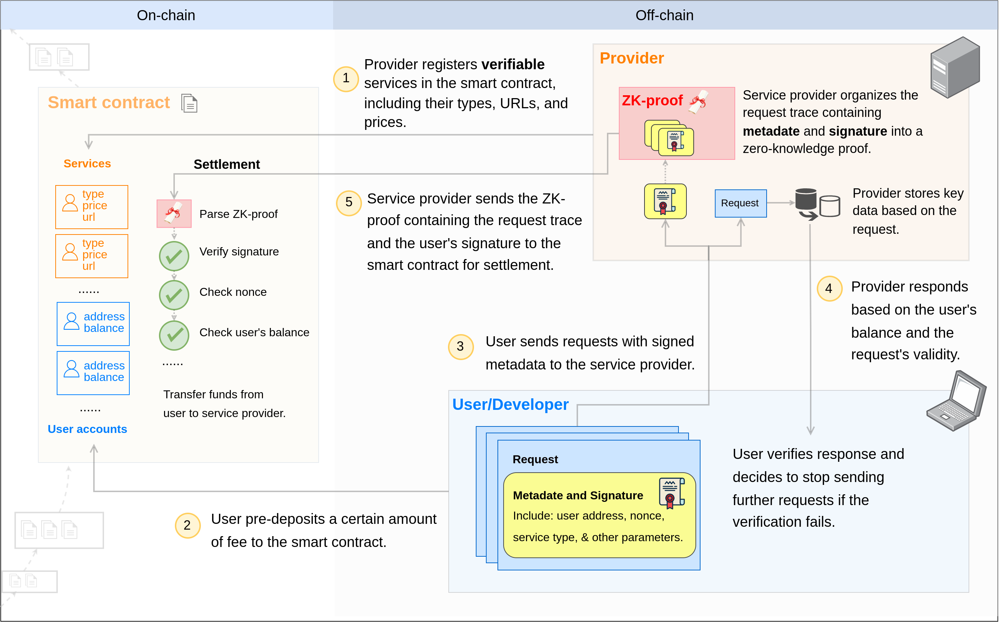

# 0G Serving Contract

## Overview

The 0G Serving Network Contract connects the [service providers](https://github.com/0glabs/0g-serving-broker) and [service users](https://github.com/0glabs/0g-serving-user-broker) to facilitate the data retrieval process.

## Serving Network Architecture

The 0G Serving Network Contract is a crucial component in the overall architecture of the 0G Serving Network (as shown in the diagram above). It validates settlement proofs, manages accounts, and handles service information. It stores essential variables during the service process, including account information, service details (such as name and URL), and consensus logic.

The contract have four files:

- **Serving.sol**: Entry point for managing accounts and services. It also and handles the fee settlement process.
- **Account.sol**: Manages user accounts and balances.
- **Service.sol**: Handles service information, including registration, updates, and deletions.
- **BatchVerifier.sol**: Implements the core logic for verifying settlement proofs. The code is generated by the [ZK Settlement Server](https://github.com/0glabs/0g-zk-settlement-server). It verifies the proofs and public inputs provided by the service provider. More details can be found in the [Settlement](./doc/settlement.md) document.

## Documentation

If you're interested in becoming a **Service Provider**, please refer to [0G Compute Network Provider Guide](https://docs.0g.ai/build-with-0g/compute-network/provider) for detailed guidelines and requirements.

If you wish to leverage provider services to develop your own projects, relevant resources are available in [0G Compute Network SDK Guide](https://docs.0g.ai/build-with-0g/compute-network/sdk).

## Support and Additional Resources

We want to do everything we can to help you be successful while working on your contribution and projects. Here you'll find various resources and communities that may help you complete a project or contribute to 0G.

### Communities

- [0G Telegram](https://t.me/web3_0glabs)
- [0G Discord](https://discord.com/invite/0glabs)
