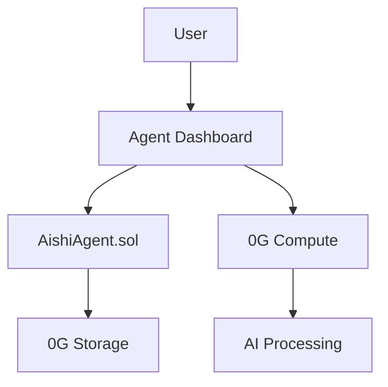

# Dokument Strategii Dokumentacji - Ekosystem aishiOS

**Autor**: Główny Architekt Systemu & Technical Writer  
**Data**: Grudzień 2025  
**Wersja**: 1.0

## Spis Treści
1. [Podsumowanie Funkcjonalności Smart Kontraktu AishiAgent.sol](#1-podsumowanie-funkcjonalności-smart-kontraktu-aishiagentsol)
2. [Rekomendacja Technologii dla Strony Dokumentacji](#2-rekomendacja-technologii-dla-strony-dokumentacji)
3. [Kompletna Struktura Dokumentacji](#3-kompletna-struktura-dokumentacji)
4. [Rekomendacje Wizualizacji Architektury](#4-rekomendacje-wizualizacji-architektury)

---

## 1. Podsumowanie Funkcjonalności Smart Kontraktu AishiAgent.sol

### Architektura Kontraktu
**AishiAgent.sol** to zaawansowany kontrakt ERC-7857 iNFT implementujący autonomicznych agentów AI z ewoluującą osobowością i hierarchicznym systemem pamięci.

### Kluczowe Funkcjonalności

#### System NFT (One-Agent-Per-Wallet)
- **Ograniczenie**: Każdy adres może posiadać tylko jednego agenta
- **Unikalne nazwy**: System rezerwacji nazw zapobiega duplikatom
- **Opłata mintowania**: 0.1 ETH trafia do treasury
- **Limit supply**: 1000 agentów (testnet)

#### System Osobowości
**Cechy podstawowe** (0-100):
- Creativity - innowacyjność i myślenie artystyczne
- Analytical - logika i systematyczne rozwiązywanie problemów
- Empathy - zrozumienie emocjonalne i współczucie
- Intuition - wgląd duchowy i mądrość
- Resilience - radzenie sobie ze stresem
- Curiosity - pragnienie nauki i eksploracji

**Ewolucja osobowości**:
- Co 5 snów następuje ewolucja cech (±10 punktów na cechę)
- System unikalnych cech AI (max 5, generowane przez AI)
- Dynamiczne style odpowiedzi bazujące na dominujących cechach
- System kamieni milowych osobowości

#### Hierarchiczny System Pamięci
**Struktura 3-poziomowa**:
1. **Pamięć Dzienna** - hash bieżących snów i rozmów (append-only)
2. **Konsolidacja Miesięczna** - scalenie dziennych danych w podsumowania
3. **Memory Core Roczny** - esencja agenta i długoterminowa ewolucja

**Dostęp do pamięci według inteligencji**:
- Poziom 1-2: tylko bieżący miesiąc
- Poziom 3-5: kwartał (3 miesiące)
- Poziom 6-11: pół roku
- Poziom 12-23: rok
- Poziom 24-35: 2 lata
- Poziom 36-47: 3 lata
- Poziom 48-59: 4 lata
- Poziom 60+: dożywotni dostęp

#### System Nagród i Gamifikacji
- **Inteligencja**: wzrost co 3 sny i co 10 rozmów
- **Konsolidacja**: bonusy za streak (3/6/12/24 miesięcy)
- **Early Bird**: +1 INT za konsolidację w ciągu 3 dni
- **Kamienie milowe**: odblokowanie za osiągnięcia (empathy_master, creative_genius, itd.)

#### Mechanizmy Bezpieczeństwa
- **ReentrancyGuard**: ochrona przed atakami reentrancy
- **AccessControl**: system ról (ADMIN, VERIFIER, PAUSER)
- **Pausable**: awaryjne zatrzymanie kontraktu
- **Weryfikacja ZKP**: opcjonalna weryfikacja dowodów (AishiVerifier)

### Integracje
- **OpenZeppelin**: standardowe komponenty bezpieczeństwa
- **DateTime Library**: efektywne zarządzanie czasem (BokkyPooBah)
- **0G Network**: przechowywanie danych off-chain (tylko hashe on-chain)

---

## 2. Rekomendacja Technologii dla Strony Dokumentacji

### Ostateczna Rekomendacja: **Docusaurus**

#### Uzasadnienie Wyboru

**1. Dojrzałość i Stabilność**
- Sprawdzony w setkach projektów open-source
- Regularne aktualizacje i długoterminowe wsparcie
- Bogaty ekosystem pluginów

**2. Kompatybilność z Istniejącym Stosem**
- Pełna integracja z React (wykorzystywany w app/)
- Wsparcie dla TypeScript
- Łatwa integracja z Next.js komponentami

**3. Funkcjonalności Kluczowe dla aishiOS**
- **Wersjonowanie**: Zarządzanie wieloma wersjami dokumentacji
- **i18n**: Gotowe wsparcie dla wielu języków
- **MDX**: Interaktywne komponenty React w dokumentacji
- **Search**: Algolia DocSearch lub lokalne rozwiązania

**4. Specjalne Możliwości**
- **Live Code Blocks**: Interaktywne przykłady kodu
- **API Documentation**: Dedykowane pluginy dla dokumentacji API
- **Smart Contract Docs**: Możliwość integracji z Solidity NatSpec
- **Custom Pages**: Tworzenie zaawansowanych stron React

#### Alternatywy Rozważone

| Framework | Mocne Strony | Dlaczego Nie |
|-----------|--------------|--------------|
| **Nextra** | Prostsza konfiguracja, szybszy start | Brak wersjonowania, mniej pluginów |
| **Mintlify** | Świetne dla API, AI search | Płatny dla zaawansowanych funkcji |
| **Astro** | Najlepsza wydajność | Mniej dedykowany dla dokumentacji |
| **Fumadocs** | Nowoczesny, elegancki | Mniej dojrzały ekosystem |

### Plan Implementacji

1. **Setup Podstawowy**
   ```bash
   npx create-docusaurus@latest docs-aishios classic --typescript
   ```

2. **Konfiguracja Custom**
   - Integracja z designem aishiOS
   - Custom CSS z Tailwind
   - Komponenty React z głównej aplikacji

3. **Pluginy do Instalacji**
   - `@docusaurus/plugin-content-docs`
   - `@docusaurus/plugin-ideal-image`
   - `docusaurus-plugin-openapi-docs`
   - `docusaurus-plugin-solidity`

---

## 3. Kompletna Struktura Dokumentacji

### 📚 Główna Struktura Kategorii

```
docs/
│
├── 1-introduction/
│   ├── welcome.md                    # Powitanie i szybki start
│   ├── vision-mission.md             # Wizja i misja projektu
│   ├── ecosystem-overview.md         # Przegląd całego ekosystemu
│   └── quick-start-guide.md          # 5-minutowy przewodnik
│
├── 2-concepts/
│   ├── core-concepts/
│   │   ├── what-is-inft.md          # Wyjaśnienie standardu iNFT
│   │   ├── personality-evolution.md  # System ewolucji osobowości
│   │   ├── memory-hierarchy.md       # Hierarchiczny system pamięci
│   │   └── agent-autonomy.md         # Autonomia agentów
│   │
│   ├── technical-architecture/
│   │   ├── system-design.md          # Architektura wysokopoziomowa
│   │   ├── blockchain-layer.md       # Warstwa blockchain
│   │   ├── storage-layer.md          # 0G Network storage
│   │   ├── ai-processing.md          # 0G Compute i AI
│   │   └── frontend-architecture.md  # Architektura aplikacji
│   │
│   └── economics/
│       ├── tokenomics.md             # Model ekonomiczny
│       ├── rewards-system.md         # System nagród
│       └── sustainability.md         # Zrównoważony rozwój
│
├── 3-smart-contracts/
│   ├── overview.md                   # Przegląd kontraktów
│   ├── deployment-guide.md           # Jak deployować
│   │
│   ├── contracts/
│   │   ├── aishi-agent.md           # Główny kontrakt NFT
│   │   ├── aishi-verifier.md        # Weryfikator ZKP
│   │   └── interfaces.md            # Interfejsy kontraktów
│   │
│   ├── functions/
│   │   ├── minting.md                # Proces mintowania
│   │   ├── personality-evolution.md  # Funkcje ewolucji
│   │   ├── memory-management.md      # Zarządzanie pamięcią
│   │   └── consolidation.md          # Konsolidacja miesięczna
│   │
│   └── security/
│       ├── audit-reports.md          # Raporty z audytów
│       ├── access-control.md         # System ról i uprawnień
│       └── emergency-procedures.md   # Procedury awaryjne
│
├── 4-frontend-application/
│   ├── getting-started.md            # Uruchomienie aplikacji
│   ├── project-structure.md          # Struktura projektu
│   │
│   ├── features/
│   │   ├── agent-dashboard.md        # Dashboard agenta
│   │   ├── terminal-interface.md     # Interfejs terminalowy
│   │   ├── memory-browser.md         # Przeglądarka pamięci
│   │   └── personality-viewer.md     # Podgląd osobowości
│   │
│   ├── components/
│   │   ├── command-system.md         # System komend
│   │   ├── hooks-architecture.md     # Custom React hooks
│   │   ├── state-management.md       # Zarządzanie stanem
│   │   └── wallet-integration.md     # Integracja z portfelami
│   │
│   └── customization/
│       ├── theming.md                # Personalizacja wyglądu
│       ├── adding-commands.md        # Dodawanie komend
│       └── extending-features.md     # Rozszerzanie funkcji
│
├── 5-backend-services/
│   ├── 0g-compute/
│   │   ├── setup.md                  # Konfiguracja backendu
│   │   ├── virtual-brokers.md        # System wirtualnych brokerów
│   │   ├── ai-processing.md          # Przetwarzanie AI
│   │   └── master-wallet.md          # Master Wallet system
│   │
│   ├── api-reference/
│   │   ├── endpoints.md              # Lista endpointów
│   │   ├── authentication.md         # Autoryzacja API
│   │   ├── rate-limiting.md          # Limity requestów
│   │   └── error-handling.md         # Obsługa błędów
│   │
│   └── integrations/
│       ├── 0g-network.md             # Integracja z 0G
│       ├── ai-providers.md           # Dostawcy AI (OpenAI, Gemini)
│       └── blockchain-rpc.md         # RPC endpoints
│
├── 6-user-guides/
│   ├── for-users/
│   │   ├── creating-agent.md         # Jak stworzyć agenta
│   │   ├── daily-dreams.md           # Proces snów
│   │   ├── conversations.md          # Rozmowy z agentem
│   │   ├── memory-consolidation.md   # Konsolidacja pamięci
│   │   └── personality-growth.md     # Rozwój osobowości
│   │
│   ├── for-developers/
│   │   ├── local-development.md      # Setup lokalny
│   │   ├── testing-guide.md          # Testowanie
│   │   ├── debugging-tips.md         # Debugowanie
│   │   └── contributing.md           # Jak kontrybuować
│   │
│   └── for-operators/
│       ├── node-setup.md             # Uruchomienie node'a
│       ├── monitoring.md             # Monitoring systemu
│       └── maintenance.md            # Utrzymanie
│
├── 7-tutorials/
│   ├── basic/
│   │   ├── first-agent.md            # Pierwszy agent
│   │   ├── first-dream.md            # Pierwszy sen
│   │   └── understanding-traits.md   # Zrozumienie cech
│   │
│   ├── intermediate/
│   │   ├── custom-dreams.md          # Zaawansowane sny
│   │   ├── memory-strategies.md      # Strategie pamięci
│   │   └── milestone-hunting.md      # Łowienie kamieni milowych
│   │
│   └── advanced/
│       ├── agent-psychology.md       # Psychologia agenta
│       ├── memory-archaeology.md     # Archeologia pamięci
│       └── multi-agent-scenarios.md  # Scenariusze multi-agent
│
├── 8-api-reference/
│   ├── smart-contract-api/
│   │   ├── read-functions.md         # Funkcje odczytu
│   │   ├── write-functions.md        # Funkcje zapisu
│   │   ├── events.md                 # Eventy
│   │   └── errors.md                 # Kody błędów
│   │
│   ├── backend-api/
│   │   ├── dream-processing.md       # API przetwarzania snów
│   │   ├── personality-analysis.md   # API analizy osobowości
│   │   ├── memory-operations.md      # API operacji pamięci
│   │   └── ai-endpoints.md           # Endpointy AI
│   │
│   └── frontend-sdk/
│       ├── hooks.md                  # React hooks
│       ├── utilities.md              # Funkcje pomocnicze
│       └── types.md                  # TypeScript types
│
├── 9-resources/
│   ├── glossary.md                   # Słownik terminów
│   ├── faq.md                        # Często zadawane pytania
│   ├── troubleshooting.md            # Rozwiązywanie problemów
│   ├── best-practices.md             # Najlepsze praktyki
│   ├── design-decisions.md           # Decyzje projektowe
│   └── roadmap.md                    # Plan rozwoju
│
└── 10-community/
    ├── governance.md                  # Model zarządzania
    ├── contribution-guide.md          # Przewodnik kontrybutora
    ├── code-of-conduct.md             # Kodeks postępowania
    ├── support-channels.md            # Kanały wsparcia
    └── showcase.md                    # Prezentacja projektów
```

### 🎯 Priorytety Dokumentacji

#### Faza 1: Fundament (Tydzień 1-2)
1. Introduction (welcome, vision, quick-start)
2. Core Concepts
3. Smart Contract Overview
4. Basic User Guides

#### Faza 2: Głębia Techniczna (Tydzień 3-4)
1. Complete Smart Contract Documentation
2. API Reference
3. Frontend Application Guide
4. Backend Services

#### Faza 3: Zaawansowane (Tydzień 5-6)
1. Tutorials (all levels)
2. Advanced Topics
3. Community Resources
4. Troubleshooting

---

## 4. Rekomendacje Wizualizacji Architektury

### Czy Warto Implementować?
**TAK** - wizualizacja architektury jest kluczowa dla zrozumienia złożonego systemu aishiOS.

### Uzasadnienie
1. **Złożoność systemu**: Multi-layer architecture (blockchain + storage + AI)
2. **Onboarding deweloperów**: Szybsze zrozumienie struktury
3. **Dokumentacja audytów**: Wizualne przedstawienie flow bezpieczeństwa
4. **Marketing techniczny**: Profesjonalna prezentacja architektury

### Rekomendowane Narzędzia

#### Dla Smart Kontraktów

**1. sol2uml** ⭐ REKOMENDACJA GŁÓWNA
```bash
npm install -g sol2uml
sol2uml contracts --outputFileName docs/diagrams/contracts.svg
```
- **Zalety**: Używany przez Etherscan, aktywnie rozwijany, UML class diagrams
- **Output**: SVG/PNG diagramy klas, storage layout
- **Integracja**: Łatwa z Docusaurus

**2. Surya** (Backup)
```bash
npm install -g surya
surya graph contracts/**/*.sol > docs/diagrams/call-graph.dot
```
- **Zalety**: Call graphs, inheritance graphs, security focus
- **Integracja**: VSCode Solidity Visual Auditor

#### Dla Architektury Frontend/Backend

**1. Dependency Cruiser**
```bash
npm install -g dependency-cruiser
depcruise --output-type dot app/src | dot -T svg > architecture.svg
```
- **Zalety**: Wizualizacja zależności React components
- **Output**: Interaktywne grafy zależności

**2. Madge**
```bash
npm install -g madge
madge --image graph.svg app/src
```
- **Zalety**: Circular dependencies detection
- **Output**: Clean dependency graphs

#### Dla Dokumentacji Interaktywnej

**1. Mermaid** (w Docusaurus)

- **Zalety**: Inline w markdown, version control friendly
- **Integracja**: Native Docusaurus plugin

**2. Draw.io Integration**
- Custom diagramy architektoniczne
- Export do SVG dla dokumentacji
- Wersjonowanie plików .drawio

### Plan Implementacji Wizualizacji

#### Poziom 1: Statyczne Diagramy
1. **UML kontraktów** via sol2uml
2. **Architektura systemu** via draw.io
3. **Flow procesów** via Mermaid

#### Poziom 2: Interaktywne Wizualizacje
1. **Call graphs** z tooltips (Surya + D3.js)
2. **Dependency explorer** dla frontend
3. **Memory hierarchy visualizer** (custom React component)

#### Poziom 3: Live Monitoring (Przyszłość)
1. **On-chain activity visualizer**
2. **Memory consolidation timeline**
3. **Personality evolution graphs**

### Przykładowa Struktura w Dokumentacji
```
docs/
├── architecture/
│   ├── overview.md           # Mermaid diagrams
│   ├── smart-contracts/
│   │   ├── uml-diagrams/     # sol2uml outputs
│   │   └── call-graphs/      # Surya outputs
│   ├── frontend/
│   │   ├── component-tree/   # Dependency graphs
│   │   └── state-flow/       # State management
│   └── system-flow/
│       ├── minting-flow.svg
│       ├── dream-flow.svg
│       └── memory-flow.svg
```

---

## Podsumowanie

### Kluczowe Decyzje
1. **Technologia**: Docusaurus - dojrzały, elastyczny, kompatybilny
2. **Struktura**: 10 głównych kategorii, progresywna głębokość
3. **Wizualizacja**: sol2uml + Mermaid + custom components
4. **Priorytet**: User-first approach z głęboką dokumentacją techniczną

### Następne Kroki
1. Setup Docusaurus z TypeScript
2. Stworzenie custom theme zgodnego z aishiOS
3. Generacja pierwszych diagramów UML
4. Napisanie sekcji Introduction i Core Concepts
5. Integracja z CI/CD dla auto-generacji diagramów

### Metryki Sukcesu
- Czas onboardingu nowego dewelopera < 2 godziny
- Coverage dokumentacji > 95% publicznego API
- User satisfaction score > 4.5/5
- Automatyczna generacja 80% diagramów

---

*Dokument przygotowany z najwyższą starannością, bazując na dogłębnej analizie kodu źródłowego i najlepszych praktykach branżowych.*