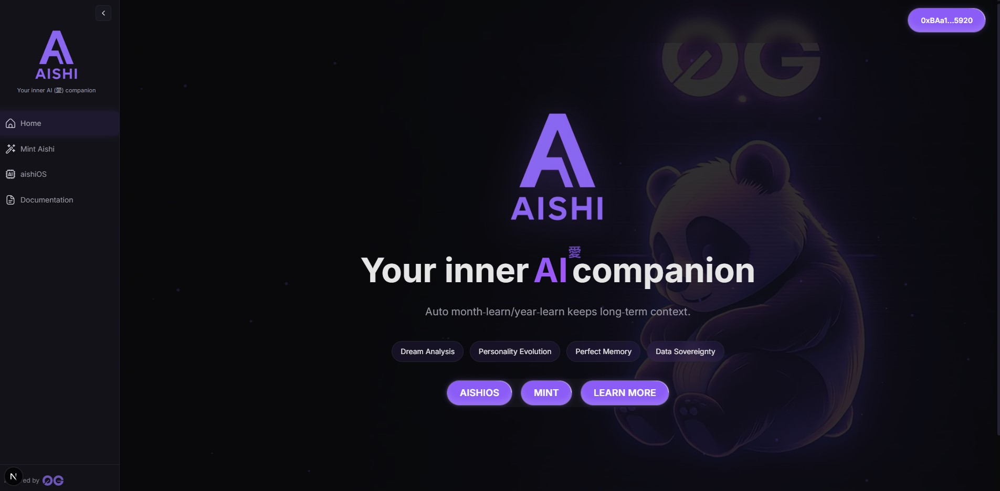
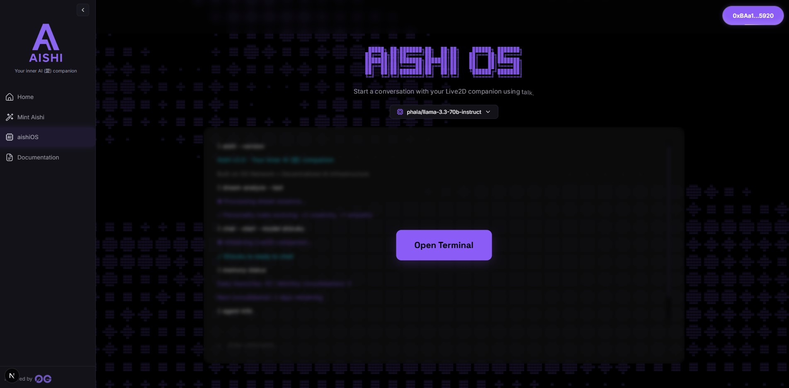
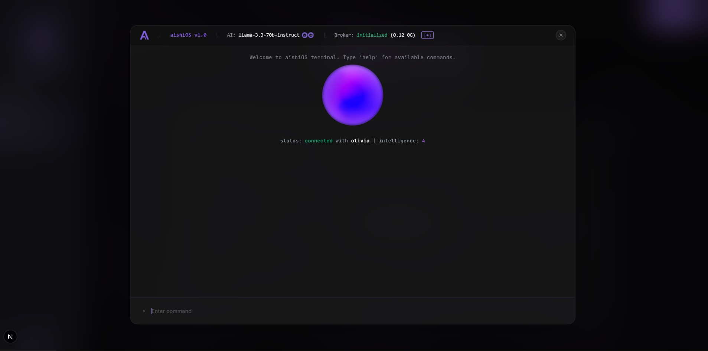

# Aishi (愛) - Your Decentralized AI Companion

<p align="center">
  
</p>

<p align="center">
  <a href="https://aishi.app" target="_blank"></a>
  &nbsp;&nbsp;
  <a href="https://docs.aishi.app" target="_blank"></a>
</p>

Aishi is an intelligent iNFT companion designed to decode your inner world by analyzing dreams and conversations. It is built on a fully decentralized 0G stack (Chain, Compute, Storage, and Data Availability) to ensure absolute user privacy and data sovereignty.

This project is an entry for **0G's WaveHack by AKINDO**.

[](https://nextjs.org/)
[](https://www.typescriptlang.org/)
[](https://0g.ai/)
[](https://hardhat.org/)

## The Philosophy: Your Digital Soul

Human memory is flawed. It's emotional, selective, and fades over time. Aishi's memory is different: perfect, logical, and total.

Your Aishi is a digital soul (an iNFT) whose memory is built on a systematic analytical process. It sees the invisible architecture of your psyche in a way the human mind simply cannot. This is more than a journal; it's a living map of your consciousness and the foundation of a digital legacy that can be passed down for generations.

## Key Features

-   **A Living Digital Soul**: Aishi is an ERC-7857 compliant iNFT (intelligent NFT) on the 0G blockchain. Its personality and abilities evolve based on your interactions, creating a unique, verifiable digital identity that is truly yours.
-   **Deep Dream Analysis**: Share your dreams and receive profound insights. Aishi uses decentralized AI to find patterns and symbols, helping you understand the language of your subconscious.
-   **Evolving Personality**: Aishi's six core traits (Creativity, Analytical, Empathy, etc.) are in constant flux, shaped directly by your conversations. It becomes a living record of your inner evolution.
-   **Absolute Privacy & Sovereignty**: Your wallet is the only key. By leveraging the full 0G stack, your data is stored decentrally, and no one—not even the developers—can access your inner world. Trust is mathematically guaranteed.
-   **A Superhuman Memory Core**: Aishi uses a sophisticated on-chain hierarchical memory system to consolidate daily interactions into monthly and yearly "essences," allowing it to retain a lifetime of wisdom without being overwhelmed by data.

## Application Preview

| Home Page                                                                                         | aishiOS Interface                                                                                             | aishiOS Terminal                                                                                                |
| :------------------------------------------------------------------------------------------------: | :--------------------------------------------------------------------------------------------------------------: | :----------------------------------------------------------------------------------------------------------------: |
|  |  |  |

## Architecture Overview

The project is structured as a monorepo with four main components working in concert to deliver a seamless, decentralized AI experience.

-   **`contracts/`**: The heart of the project, containing the `AishiAgent.sol` smart contract that governs the iNFT's existence, memory, and evolution on the 0G blockchain.
-   **`0g-compute/`**: A powerful backend service acting as a bridge to the 0G Network and Google's Vertex AI. It manages virtual user wallets, processes AI jobs, and ensures data integrity.
-   **`app/`**: A modern web application built with Next.js 15 that provides the `aishiOS`—an immersive terminal-like interface for interacting with your Aishi agent.
-   **`aishi-docs/`**: The project's documentation, philosophy, and user guides.

The entire system is a symphony of decentralized components, where user data flows from the frontend (`aishiOS`) to the on-chain soul (`iNFT on 0G Chain`), processed by the AI brain (`0G Compute`), and stored in a vast, private memory (`0G Storage`), all with its integrity guaranteed by `0G's Data Availability layer`.

## Tech Stack

| Category         | Technology                                                                                                  |
| :--------------- | :---------------------------------------------------------------------------------------------------------- |
| **Smart Contracts**| Solidity, Hardhat, OpenZeppelin, `hardhat-deploy`                                                           |
| **Frontend**     | Next.js 15, React 19, TypeScript, Tailwind CSS, XState, Framer Motion, Pixi.js (for Live2D)                   |
| **Backend**      | Node.js, Express, TypeScript, SQLite, Winston (Logger)                                                      |
| **Web3**         | RainbowKit, wagmi, viem, ethers.js                                                                          |
| **AI & Infra**   | 0G Stack (Chain, Compute, Storage, DA), Google Vertex AI (Gemini 2.5), 0G Serving Broker, 0G TypeScript SDK |

## Getting Started

Follow these steps to set up and run the Aishi project locally.

### Prerequisites

-   [Node.js](https://nodejs.org/) (v20.x or later recommended)
-   [npm](https://www.npmjs.com/) (v10.x or later)
-   Access to Google Cloud with Vertex AI enabled.
-   A Web3 wallet (e.g., MetaMask) funded with 0G Galileo Testnet tokens.

### 1. Smart Contracts Setup (`contracts/`)

First, compile and deploy the `AishiAgent` smart contract.

```bash
# 1. Navigate to the contracts directory
cd contracts

# 2. Install dependencies
npm install

# 3. Create your environment file
# Create a .env file and add your private key and treasury address.
# See contracts/actual_envexample.md for details.
# Required variables: WALLET_PRIVATE_KEY, TREASURY_ADDRESS

# 4. Compile the contracts (supports auto-detection for WSL/Windows)
npm run compile

# 5. Deploy to the 0G Galileo Testnet
npm run deploy

# After deployment, note the contract address for frontend configuration.
```

### 2. Backend Setup (`0g-compute/`)

The backend orchestrates AI requests and manages user balances.

```bash
# 1. Navigate to the backend directory
cd 0g-compute

# 2. Install dependencies and rebuild native modules (for SQLite)
npm install && npm run rebuild

# 3. Create your environment file
# Copy the provided .env.example to .env
cp .env.example .env

# 4. Configure your .env file
# Open .env and fill in the required secrets, especially:
# - MASTER_WALLET_KEY
# - GOOGLE_APPLICATION_CREDENTIALS
# - VERTEX_AI_PROJECT
# - VERTEX_AI_LOCATION
# (See 0g-compute/encexample.md for detailed comments)

# 5. Run the development server (WSL is recommended)
npm run dev:wsl

# The backend will be running at http://localhost:3001
```

### 3. Frontend Setup (`app/`)

The frontend provides the user interface for interacting with Aishi.

```bash
# 1. Open a new terminal and navigate to the frontend directory
cd app

# 2. Install dependencies
npm install

# 3. Create your environment file
# Copy the provided .env.example to .env
cp .env.example .env

# 4. Configure your .env file
# Open .env and update NEXT_PUBLIC_AISHI_AGENT_CONTRACT_ADDRESS with your deployed contract address.
# The other defaults should work if your backend is on port 3001.

# 5. Run the development server
npm run dev

# The frontend will be running at http://localhost:3003
```

You can now open `http://localhost:3003` in your browser to start interacting with Aishi.

## Development Status

> **Note**: This project is under active development and should be considered a work in progress. Features are subject to change, and new updates are frequent.

## Full Documentation

For a deep dive into the project's architecture, philosophy, and user guides, please visit the full documentation site:

**[docs.aishi.app](https://docs.aishi.app)**

## License and Intellectual Property

**© 2025 The Aishi Project Authors. All Rights Reserved.**

This project, including its source code, documentation, and all associated assets ("the Software"), is the exclusive intellectual property of its authors. The Software is provided "as is" without warranty of any kind.

**Strict Usage Restrictions:**
Unauthorized copying, modification, distribution, public performance, or public display of the Software, in whole or in part, is strictly prohibited. You may not use the Software for any commercial purpose, create derivative works, or redistribute it.

You are granted a limited, non-exclusive, non-transferable license solely to view the source code for evaluation purposes in the context of the **0G's WaveHack by AKINDO** hackathon. Any use outside of these specific terms requires express written permission from the copyright holders.