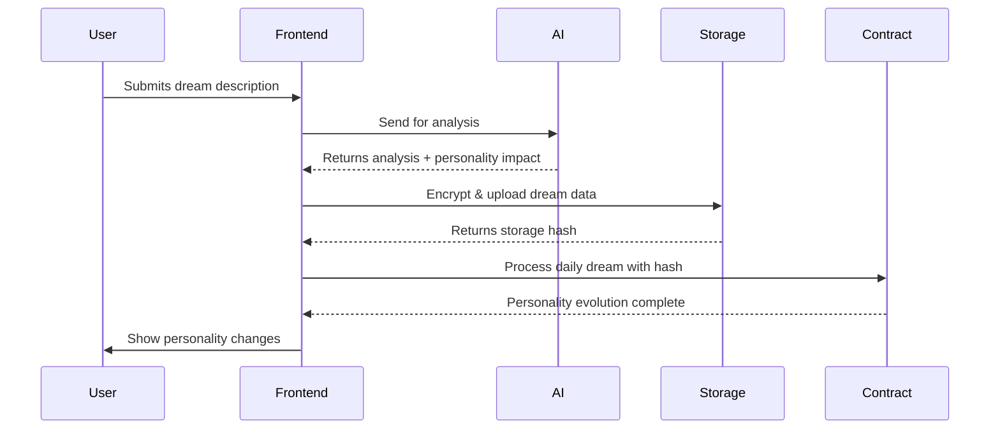
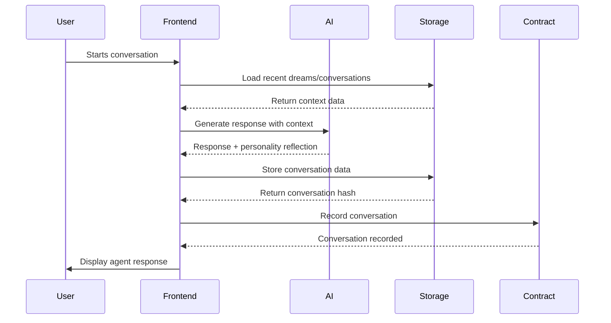

# 🗄️ 0G Storage Architecture Documentation

## Overview

The Dreamscape iNFT system uses 0G Storage for decentralized, encrypted storage of dreams, conversations, and AI analysis data. This ensures privacy, permanence, and owner-controlled access to sensitive personal data.

## 🔒 Security Model

### Encryption Strategy
- **AES-256-GCM**: Symmetric encryption for data payloads
- **RSA-4096/ECC-P384**: Asymmetric encryption for key sealing
- **User Public Key**: Data encrypted for specific owner
- **Re-encryption**: Secure transfer via TEE/ZKP proofs

### Access Control
```typescript
interface AccessControl {
  owner: string;          // Primary data owner
  authorizedUsers: string[]; // Users with read access
  encryptionKey: string;     // Sealed with owner's public key
  accessType: "private" | "shared" | "authorized";
}
```

## 📊 Data Structure Definitions

### 1. Dream Data Structure

```typescript
interface DreamData {
  // Metadata
  id: string;                    // Unique dream identifier
  timestamp: Date;               // When dream occurred
  version: string;               // Data structure version
  agentId: string;              // Associated iNFT token ID
  
  // User Input
  userInput: {
    dreamDescription: string;    // Raw dream description
    audioTranscript?: string;    // Whisper transcription if audio
    emotionalState: string;      // User's emotional state when reporting
    tags: string[];              // User-added tags
    lucidityLevel: number;       // 0-10 how lucid the dream was
    vividnessLevel: number;      // 0-10 how vivid the dream was
    sleepQuality: number;        // 0-10 sleep quality rating
  };
  
  // AI Analysis Results
  aiAnalysis: {
    interpretation: string;      // Main dream interpretation
    confidence: number;          // AI confidence score (0-100)
    symbols: DreamSymbol[];      // Identified symbolic elements
    emotionalTones: string[];    // Detected emotional themes
    themes: string[];            // Recurring themes identified
    
    // Personality Impact Analysis
    personalityInsights: {
      creativity: number;        // -10 to +10 impact
      analytical: number;        // -10 to +10 impact
      empathy: number;          // -10 to +10 impact
      intuition: number;        // -10 to +10 impact
      resilience: number;       // -10 to +10 impact
      curiosity: number;        // -10 to +10 impact
    };
    
    // Future Predictions
    predictions?: {
      timeframe: string;         // "next few days", "this week"
      content: string;           // Predicted insights
      confidence: number;        // Prediction confidence
    };
    
    // Processing Metadata
    modelUsed: string;          // AI model version
    processingTime: number;     // Analysis duration
    contextUsed: string[];      // Previous dreams referenced
  };
  
  // Evolution Triggers
  evolutionTriggers: {
    personalityChanges: PersonalityTraits;
    intelligenceBoost: boolean;
    newTraits: string[];
    moodShift: string;
    evolutionWeight: number;    // How much this dream affects personality
  };
  
  // Storage Metadata
  storageInfo: {
    encryptionMethod: string;   // "AES-256-GCM"
    compressionUsed: boolean;   // If data was compressed
    storageNetwork: "standard" | "turbo";
    redundancyLevel: number;    // Storage redundancy
    accessPattern: "daily" | "archived" | "frequent";
  };
}

interface DreamSymbol {
  symbol: string;               // Symbol name (e.g., "water", "flying")
  meaning: string;              // Interpreted meaning
  frequency: number;            // How often it appears in user's dreams
  context: string;              // Context within this dream
  culturalMeaning?: string;     // Cultural interpretation
  personalMeaning?: string;     // User's personal association
}
```

### 2. Conversation Data Structure

```typescript
interface ConversationData {
  // Metadata
  id: string;                   // Unique conversation identifier
  timestamp: Date;              // Conversation start time
  version: string;              // Data structure version
  agentId: string;             // Associated iNFT token ID
  
  // Conversation Content
  messages: ChatMessage[];      // Full conversation history
  
  // Context Information
  contextType: "dream_discussion" | "general_chat" | "personality_query" | "therapeutic" | "advice_seeking";
  referencedDreams: string[];   // Dream IDs discussed
  referencedConversations: string[]; // Previous conversations referenced
  
  // Personality Reflection
  personalityReflection: {
    traitsDisplayed: string[];  // Which personality traits were shown
    emotionalTone: string;      // Overall emotional tone
    responseStyle: string;      // How agent responded
    empathyLevel: number;       // 0-100 empathy shown in conversation
    creativityLevel: number;    // 0-100 creativity shown
    analyticalLevel: number;    // 0-100 analytical thinking shown
  };
  
  // AI Optimization for Context
  aiOptimization: {
    contextSummary: string;     // Compressed conversation summary
    keyMemories: string[];      // Important points to remember
    emotionalHighlights: string[]; // Key emotional moments
    
    // Token-optimized for AI context
    trimmedConversation: {
      role: "user" | "agent";
      content: string;
      importance: number;       // 0-100 importance score
      timestamp: Date;
    }[];
    
    // Memory categorization
    memories: {
      factual: string[];        // Facts learned about user
      emotional: string[];      // Emotional patterns
      behavioral: string[];     // Behavioral patterns
      preferences: string[];    // User preferences
    };
  };
  
  // Quality Metrics
  qualityMetrics: {
    userSatisfaction?: number;  // 0-100 if user rated
    helpfulness: number;        // AI-assessed helpfulness
    coherence: number;          // Conversation coherence score
    personalityConsistency: number; // How consistent agent personality was
  };
  
  // Storage Metadata
  storageInfo: {
    encryptionMethod: string;
    compressionRatio: number;   // How much data was compressed
    storageNetwork: "standard" | "turbo";
    accessFrequency: "high" | "medium" | "low";
  };
}

interface ChatMessage {
  role: "user" | "agent";
  content: string;
  timestamp: Date;
  metadata?: {
    emotionalTone?: string;
    confidence?: number;
    personalityTraitsUsed?: string[];
    referencedMemories?: string[];
  };
}
```

### 3. Agent Personality Snapshot

```typescript
interface PersonalitySnapshot {
  // Metadata
  id: string;
  agentId: string;
  timestamp: Date;
  snapshotType: "daily" | "milestone" | "manual";
  
  // Current Personality State
  currentTraits: PersonalityTraits;
  
  // Evolution History
  evolutionHistory: {
    date: Date;
    dreamId?: string;
    conversationId?: string;
    traitChanges: Partial<PersonalityTraits>;
    triggerEvent: string;
  }[];
  
  // Analytics
  analytics: {
    totalDreamsProcessed: number;
    totalConversations: number;
    personalityVariance: number;  // How much personality has changed
    dominantTraits: string[];     // Top 3 strongest traits
    evolutionRate: number;        // How fast personality is evolving
  };
  
  // Response Style Evolution
  responseEvolution: {
    vocabularyComplexity: number; // Growing vocabulary sophistication
    empathyExpressions: string[]; // How empathy is expressed
    creativePhrases: string[];    // Creative expressions used
    analyticalPatterns: string[]; // Analytical response patterns
  };
}
```

## 🔄 Storage Flow Patterns

### Daily Dream Storage Flow



### Conversation Storage Flow



## 🗂️ Storage Organization

### Directory Structure on 0G Storage

```
/dreamscape/
├── agents/
│   ├── {agentId}/
│   │   ├── dreams/
│   │   │   ├── 2024-01/
│   │   │   │   ├── dream_001.json.enc
│   │   │   │   ├── dream_002.json.enc
│   │   │   │   └── ...
│   │   │   └── 2024-02/
│   │   ├── conversations/
│   │   │   ├── 2024-01/
│   │   │   │   ├── chat_001.json.enc
│   │   │   │   └── ...
│   │   │   └── 2024-02/
│   │   ├── personality/
│   │   │   ├── snapshots/
│   │   │   │   ├── snapshot_001.json.enc
│   │   │   │   └── ...
│   │   │   └── evolution_log.json.enc
│   │   └── analytics/
│   │       ├── monthly_reports/
│   │       └── milestone_achievements/
│   └── ...
└── global/
    ├── personality_analytics/
    ├── dream_pattern_analysis/
    └── evolution_statistics/
```

## 🔧 Context Optimization Strategies

### AI Context Building

```typescript
interface AIContext {
  // Recent Dreams (Last 5-10)
  recentDreams: {
    dream: DreamData;
    relevanceScore: number;      // How relevant to current conversation
    keyInsights: string[];       // Most important insights
  }[];
  
  // Recent Conversations (Last 3-5)
  recentConversations: {
    conversation: ConversationData;
    relevanceScore: number;
    keyMemories: string[];
  }[];
  
  // Personality Summary
  personalitySummary: {
    dominantTraits: string[];
    currentMood: string;
    responseStyle: string;
    recentEvolution: string[];   // Recent personality changes
  };
  
  // Context Optimization
  optimization: {
    totalTokens: number;         // Estimated context size
    compressionRatio: number;    // How much data was compressed
    relevanceThreshold: number;  // Minimum relevance to include
    contextAge: number;          // How recent data should be
  };
}
```

### Memory Prioritization

```typescript
interface MemoryPriority {
  // High Priority (Always Include)
  critical: {
    recentDreams: number;        // Last N dreams
    emotionalMoments: string[];  // Key emotional conversations
    personalityMilestones: string[]; // Major personality changes
  };
  
  // Medium Priority (Include if Space)
  important: {
    recurringThemes: string[];   // Patterns across dreams
    helpfulConversations: string[]; // Conversations that helped user
    creativeMoments: string[];   // Creative expressions
  };
  
  // Low Priority (Summarize Only)
  background: {
    generalChats: string[];      // Casual conversations
    analyticalDiscussions: string[]; // Technical discussions
    repetitiveContent: string[]; // Similar conversations
  };
}
```

## 📊 Storage Analytics

### Cost Optimization

```typescript
interface StorageMetrics {
  // Storage Costs
  totalStorageUsed: number;     // Bytes stored
  monthlyCost: number;          // Cost in OG tokens
  compressionSavings: number;   // Savings from compression
  
  // Access Patterns
  accessFrequency: {
    dreams: number;             // Dreams accessed per month
    conversations: number;      // Conversations accessed per month
    personality: number;        // Personality data accessed
  };
  
  // Optimization Opportunities
  optimization: {
    archivableDreams: number;   // Old dreams to archive
    compressibleChats: number;  // Conversations to compress more
    redundantData: number;      // Duplicate data to remove
  };
}
```

### Performance Metrics

```typescript
interface PerformanceMetrics {
  // Retrieval Speed
  averageLoadTime: number;      // ms to load conversation context
  cacheHitRate: number;         // % of data served from cache
  compressionSpeed: number;     // Data compression rate
  
  // Context Building
  contextBuildTime: number;     // Time to build AI context
  relevanceAccuracy: number;    // How accurate relevance scoring is
  tokenEfficiency: number;      // Tokens used vs available
}
```

## 🛡️ Privacy & Security

### Encryption Layers

1. **Client-Side Encryption**: Data encrypted before leaving user's device
2. **Transport Encryption**: TLS for data in transit
3. **Storage Encryption**: Additional encryption layer on 0G Storage
4. **Key Rotation**: Regular encryption key updates

### Access Control Matrix

| Data Type | Owner | Authorized Users | Smart Contract | AI Processing |
|-----------|-------|------------------|----------------|---------------|
| **Dreams** | Full Access | Read Only | Hash Only | Encrypted Processing |
| **Conversations** | Full Access | No Access | Hash Only | Encrypted Processing |
| **Personality** | Full Access | Trait View Only | Full Access | Read Only |
| **Analytics** | Full Access | No Access | Aggregated Only | No Access |

### Audit Trail

```typescript
interface AuditLog {
  timestamp: Date;
  action: "create" | "read" | "update" | "delete";
  dataType: "dream" | "conversation" | "personality";
  userId: string;
  agentId: string;
  success: boolean;
  details?: string;
}
```

## 🚀 Implementation Best Practices

### Data Lifecycle Management

1. **Creation**: Encrypt immediately, store with redundancy
2. **Active Use**: High-speed retrieval, context optimization
3. **Archival**: Compress and move to slower storage
4. **Retention**: Delete after user-defined period

### Error Handling

```typescript
interface StorageError {
  code: string;
  message: string;
  retryable: boolean;
  fallbackStrategy: "cache" | "degraded" | "offline";
}
```

### Monitoring & Alerts

- **Storage Quota**: Warn when approaching limits
- **Access Patterns**: Detect unusual access attempts
- **Performance**: Alert on slow retrieval times
- **Encryption**: Monitor key rotation and validity

---

## 🔮 Future Enhancements

### Advanced Features
- **Cross-Agent Context**: Shared insights between compatible agents
- **Semantic Search**: Find dreams/conversations by meaning
- **Predictive Caching**: Pre-load likely needed data
- **Federated Storage**: Distribute across multiple 0G networks

**Secure, private, and infinitely scalable storage for digital consciousness.** 🌟 