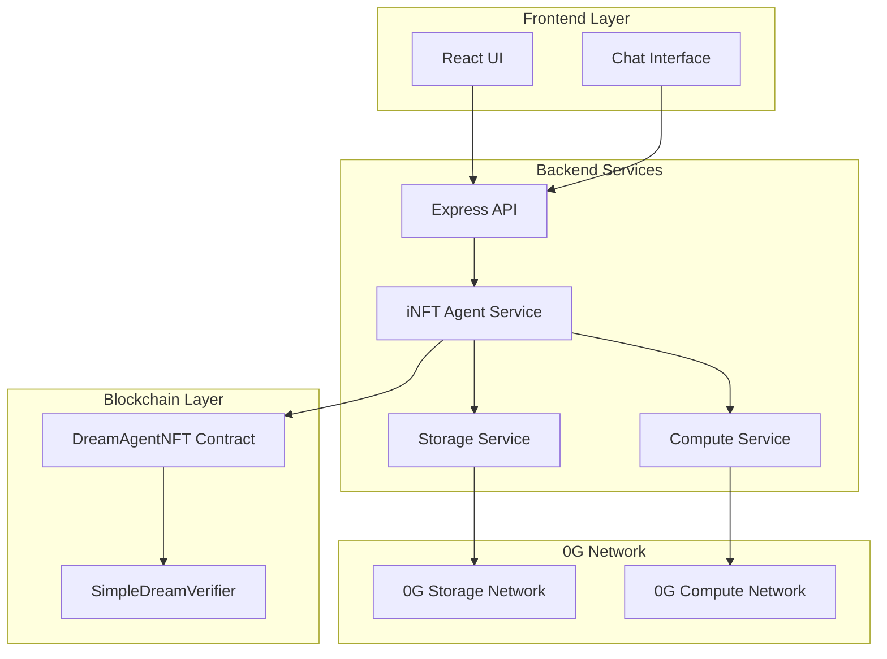
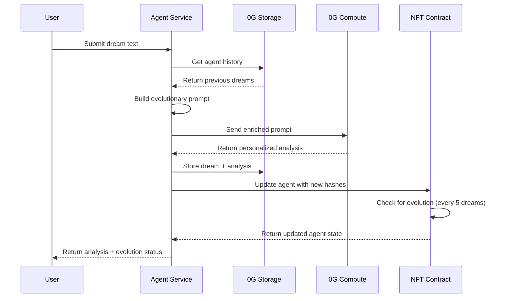

# 🧠 **Dreamscape iNFT Agent - Kompletny System Flow**

## **📋 SPIS TREŚCI**
1. [Co to jest iNFT Agent?](#co-to-jest-inft-agent)
2. [Architektura Systemu](#architektura-systemu)
3. [Tworzenie Agenta (Minting)](#tworzenie-agenta-minting)
4. [Przetwarzanie Snów](#przetwarzanie-snów)
5. [System Pamięci i Ewolucji](#system-pamięci-i-ewolucji)
6. [Przepływ Danych](#przepływ-danych)
7. [Komponenty Techniczne](#komponenty-techniczne)
8. [API Endpoints](#api-endpoints)
9. [Bezpieczeństwo](#bezpieczeństwo)
10. [Ekonomia Systemu](#ekonomia-systemu)
11. [Przykłady Użycia](#przykłady-użycia)
12. [Przyszłe Rozszerzenia](#przyszłe-rozszerzenia)

---

## **🤖 Co to jest iNFT Agent?**

**iNFT (Intelligent NFT) Dream Agent** to rewolucyjny system, gdzie każdy NFT zawiera **prawdziwą sztuczną inteligencję**, która:

- 🧠 **Się uczy** z każdym przeanalizowanym snem
- 📚 **Pamięta** całą historię użytkownika  
- 🎯 **Personalizuje** analizy na podstawie wzorców
- 📈 **Ewoluuje** do wyższych poziomów inteligencji
- 💾 **Przechowuje** swoją wiedzę w zdecentralizowanym storage (0G)

### **Kluczowe różnice:**

| Zwykły NFT | iNFT Dream Agent |
|------------|------------------|
| Statyczny obraz | Dynamiczna inteligencja |
| Nie zmienia się | Ewoluuje z czasem |
| Brak funkcjonalności | Analizuje sny |
| Wartość = rzadkość | Wartość = inteligencja |

---

## **🏗️ Architektura Systemu**



### **Główne komponenty:**

1. **DreamAgentNFT.sol** - Smart contract zarządzający agentami
2. **INFTAgentService.js** - Backend service dla logiki agenta
3. **0G Storage** - Zdecentralizowane przechowywanie danych
4. **0G Compute** - AI/ML obliczenia
5. **SimpleDreamVerifier.sol** - Weryfikacja proof'ów

---

## **🎯 Tworzenie Agenta (Minting)**

### **Krok 1: Generowanie początkowej inteligencji**

```javascript
// 1. PERSONALITY CORE (główna inteligencja)
const initialPersonality = {
  userId: "0x123...",                    // Właściciel
  createdAt: Date.now(),                 // Timestamp stworzenia
  dreamCount: 0,                         // Początkowo 0
  patterns: {},                          // Wzorce (początkowo puste)
  emotionalProfile: {
    dominant: [],                        // Dominujące emocje
    triggers: [],                        // Triggery emocjonalne
    improvements: []                     // Postęp w rozwoju
  },
  intelligenceLevel: 1,                  // Poziom 1 na start
  personalizedPrompts: {
    basePrompt: "Analyze this dream with focus on personal growth...",
    contextMemory: []                    // Historia kontekstu
  },
  version: "1.0"
};

// 2. DREAM PATTERNS (wzorce snów)
const initialPatterns = {
  flyingDreams: 0,                       // Latanie
  stressIndicators: 0,                   // Wskaźniki stresu
  lucidDreamTriggers: 0,                 // Triggery świadomych snów
  symbolicElements: {},                  // Elementy symboliczne
  emotionalTrends: []                    // Trendy emocjonalne
};

// 3. EMOTIONAL PROFILE (profil emocjonalny)
const initialEmotions = {
  dominantEmotions: [],                  // Główne emocje
  fearPatterns: [],                      // Wzorce lęków
  joyTriggers: [],                       // Triggery radości
  stressFactors: [],                     // Czynniki stresowe
  healingProgress: {}                    // Postęp w leczeniu
};
```

### **Krok 2: Upload do 0G Storage**

```javascript
// Zapisujemy każdy komponent osobno w 0G Storage
const personalityUpload = await storageService.uploadJSON(initialPersonality);
const patternsUpload = await storageService.uploadJSON(initialPatterns);
const emotionsUpload = await storageService.uploadJSON(initialEmotions);

console.log('Hashes generated:');
console.log('Personality:', personalityUpload.rootHash);
console.log('Patterns:', patternsUpload.rootHash);
console.log('Emotions:', emotionsUpload.rootHash);
```

### **Krok 3: Minting NFT**

```javascript
// Przygotowujemy proof'y dla smart contract
const proofs = [
  personalityUpload.rootHash,            // Hash inteligencji
  patternsUpload.rootHash,               // Hash wzorców
  emotionsUpload.rootHash                // Hash emocji
].map(hash => convertToContractProof(hash));

const descriptions = [
  "agent_intelligence",                  // Opis inteligencji
  "dream_patterns",                      // Opis wzorców
  "emotional_profile"                    // Opis profilu
];

// Mintujemy NFT z inteligencją
const tx = await contract.mint(proofs, descriptions, userAddress);
const tokenId = extractTokenIdFromTx(tx);
```

### **Rezultat:**
```javascript
const newAgent = {
  tokenId: 1,                           // Unikalny ID agenta
  owner: "0x123...",                    // Właściciel
  intelligenceLevel: 1,                 // Poziom startowy
  dreamCount: 0,                        // Brak snów
  dataHashes: [personalityHash, patternsHash, emotionsHash],
  createdAt: timestamp
};
```

---

## **💭 Przetwarzanie Snów**

### **FLOW kompletnego przetwarzania:**



### **Krok 1: Pobieranie historii agenta**

```javascript
async function getAgentHistory(tokenId) {
  // Pobieramy informacje o agencie z kontraktu
  const agentInfo = await contract.getAgentInfo(tokenId);
  
  // Pobieramy poprzednie sny z 0G Storage  
  const dreamHistory = [];
  const limit = Math.min(agentInfo.intelligenceLevel + 2, 10);
  
  // Im wyższy poziom, tym więcej kontekstu używamy
  for (let i = Math.max(0, agentInfo.dreamCount - limit); i < agentInfo.dreamCount; i++) {
    const dreamHash = await getPreviousDreamHash(tokenId, i);
    const dreamData = await storageService.downloadJSON(dreamHash);
    dreamHistory.push(dreamData);
  }
  
  return dreamHistory;
}
```

### **Krok 2: Budowanie spersonalizowanego prompt'u**

```javascript
function buildEvolutionaryPrompt(dreamText, dreamCount, intelligenceLevel, dreamHistory) {
  // Analizujemy wzorce z historii
  const recurringSymbols = findRecurringSymbols(dreamHistory, dreamText);
  const emotionalProgression = analyzeEmotionalProgression(dreamHistory);
  const thematicEvolution = analyzeThematicEvolution(dreamHistory, dreamText);
  
  // Budujemy spersonalizowany prompt
  const prompt = `
🧠 AGENT LEVEL ${intelligenceLevel} ANALYSIS REQUEST

CURRENT DREAM: "${dreamText}"

📊 USER CONTEXT:
- Total dreams analyzed: ${dreamCount}
- Intelligence Level: ${intelligenceLevel}
- Evolution Stage: ${determineEvolutionStage(intelligenceLevel, dreamCount)}

🔄 HISTORICAL PATTERNS:
- Recurring symbols: ${recurringSymbols.join(', ')}
- Emotional progression: ${emotionalProgression}
- Thematic evolution: ${JSON.stringify(thematicEvolution)}

📚 PREVIOUS DREAMS CONTEXT:
${dreamHistory.map((dream, i) => `
Dream ${i+1}: "${dream.summary || dream.text.substring(0, 100)}..."
Analysis: ${dream.analysis?.substring(0, 150)}...
`).join('\n')}

🎯 EVOLUTIONARY ANALYSIS REQUEST:
1. Build on established patterns from previous dreams
2. Identify new themes and their connection to user's journey  
3. Track emotional and psychological progression
4. Provide personalized growth insights based on full history
5. Suggest specific techniques relevant to recurring patterns
6. Note any evolution in dream complexity or lucidity

Level ${intelligenceLevel} Specialization:
${getSpecializationForLevel(intelligenceLevel)}

Please provide a comprehensive analysis that demonstrates growth from previous interactions.
  `;
  
  return prompt;
}
```

### **Krok 3: Analiza przez 0G Compute**

```javascript
// Wysyłamy wzbogacony prompt do 0G Compute
const analysis = await computeService.sendSimpleQuery(evolutionaryPrompt);

// Otrzymujemy znacznie bardziej spersonalizowaną odpowiedź:
const personalizedAnalysis = {
  response: "Based on your recurring water themes and previous anxiety patterns...",
  cost: 0.0012,
  model: "llama3-8b-instruct",
  personalizedInsights: true,
  evolutionaryContext: true
};
```

### **Krok 4: Zapisywanie wyników**

```javascript
// Zapisujemy nowy sen
const dreamUpload = await storageService.uploadJSON({
  text: dreamData.text,
  timestamp: Date.now(),
  agentTokenId: tokenId,
  dreamNumber: currentDreamCount + 1,
  intelligenceLevelAtTime: currentIntelligence,
  inputType: 'text'
});

// Zapisujemy ewolucyjną analizę
const analysisUpload = await storageService.uploadJSON({
  dreamHash: dreamUpload.rootHash,
  analysis: analysis.response,
  evolutionaryPatterns: {
    recurringSymbols: recurringSymbols,
    emotionalProgression: emotionalProgression,
    thematicEvolution: thematicEvolution,
    growthIndicators: identifyGrowthIndicators(dreamHistory),
    personalInsights: generatePersonalInsights(dreamHistory, dreamText)
  },
  agentTokenId: tokenId,
  intelligenceLevel: currentIntelligence,
  dreamCount: currentDreamCount + 1,
  historicalContext: dreamHistory.length,
  evolutionStage: determineEvolutionStage(currentIntelligence, currentDreamCount + 1),
  timestamp: Date.now()
});
```

### **Krok 5: Aktualizacja NFT**

```javascript
// Przygotowujemy proof'y dla kontraktu
const updateProofs = [
  dreamUpload.rootHash,      // Hash nowego snu
  analysisUpload.rootHash,   // Hash analizy
  analysisUpload.rootHash    // Duplikat dla zgodności
].map(hash => convertToContractProof(hash));

// Aktualizujemy agent na blockchain
const updateTx = await contract.update(tokenId, updateProofs);
await updateTx.wait();

// Kontrakt automatycznie:
// 1. Zwiększa dreamCount
// 2. Sprawdza czy dreamCount % 5 == 0
// 3. Jeśli tak, zwiększa intelligenceLevel
// 4. Emituje AgentEvolved event
```

---

## **🧠 System Pamięci i Ewolucji**

### **Struktura pamięci w 0G Storage:**

```javascript
// ORGANIZACJA DANYCH PER AGENT
const agentMemoryStructure = {
  // === CORE AGENT DATA ===
  "agent_core/": {
    "personality.json": {               // Główna inteligencja
      userId: "0x123...",
      intelligenceLevel: 3,
      patterns: {...},
      emotionalProfile: {...},
      personalizedPrompts: {...}
    },
    "patterns.json": {                  // Wzorce snów  
      flyingDreams: 5,
      stressIndicators: 12,
      symbolicElements: {...}
    },
    "emotions.json": {                  // Profil emocjonalny
      dominantEmotions: ["curiosity", "anxiety"],
      healingProgress: {...}
    }
  },
  
  // === CHRONOLOGICAL DREAMS ===
  "dreams/": {
    "dream_001.json": { text: "...", timestamp: "...", level: 1 },
    "dream_002.json": { text: "...", timestamp: "...", level: 1 },
    "dream_005.json": { text: "...", timestamp: "...", level: 2 }, // Po ewolucji
    "dream_010.json": { text: "...", timestamp: "...", level: 3 }
  },
  
  // === EVOLUTIONARY ANALYSES ===  
  "analyses/": {
    "analysis_001.json": {
      analysis: "Basic dream interpretation...",
      evolutionStage: "Novice Helper",
      patterns: ["water", "anxiety"],
      historicalContext: 0
    },
    "analysis_010.json": {
      analysis: "Advanced analysis building on your recurring water symbolism, which has evolved from anxiety-inducing (dreams 1-3) to healing-focused (dreams 7-9)...",
      evolutionStage: "Advanced Guide", 
      patterns: ["water:healing", "lucid_awareness"],
      historicalContext: 9
    }
  }
};
```

### **Poziomy inteligencji i ich możliwości:**

```javascript
const intelligenceLevels = {
  1: {
    name: "Novice Helper",
    dreams: "0-4",
    capabilities: [
      "Podstawowa interpretacja symboli",
      "Rozpoznawanie głównych emocji",
      "Ogólne porady dotyczące snów"
    ],
    prompt_enhancement: "Basic dream analysis",
    context_memory: 0
  },
  
  2: {
    name: "Learning Assistant", 
    dreams: "5-9",
    capabilities: [
      "Porównywanie wzorców między snami",
      "Identyfikacja powtarzających się tematów",
      "Proste analizy progresji emocjonalnej"
    ],
    prompt_enhancement: "Pattern recognition",
    context_memory: 3
  },
  
  3: {
    name: "Developing Analyst",
    dreams: "10-14", 
    capabilities: [
      "Analiza trendów długoterminowych",
      "Personalizowane techniki pracy ze snami",
      "Korelacja między życiem a snami"
    ],
    prompt_enhancement: "Trend analysis and personalization",
    context_memory: 5
  },
  
  4: {
    name: "Advanced Guide",
    dreams: "15-19",
    capabilities: [
      "Głębokie psychologiczne wglądy",
      "Przewidywanie wzorców",
      "Zaawansowane techniki świadomego śnienia"
    ],
    prompt_enhancement: "Psychological insights and prediction",
    context_memory: 7
  },
  
  5: {
    name: "Master Interpreter",
    dreams: "20+",
    capabilities: [
      "Holistyczna analiza rozwoju osobistego",
      "Integracja snów z pracą terapeutyczną",
      "Mentoring w rozwoju duchowym"
    ],
    prompt_enhancement: "Holistic personal development",
    context_memory: 10
  }
};
```

### **Automatyczna ewolucja w smart contract:**

```solidity
// DreamAgentNFT.sol - logika ewolucji
function update(uint256 tokenId, bytes[] calldata proofs) external {
    require(agents[tokenId].owner == msg.sender, "Not agent owner");
    
    // Weryfikacja proof'ów przez SimpleDreamVerifier
    PreimageProofOutput[] memory proofOutputs = verifier.verifyPreimage(proofs);
    
    // Aktualizacja danych agenta
    agents[tokenId].dataHashes = newDataHashes;
    agents[tokenId].lastUpdated = block.timestamp;
    agents[tokenId].dreamCount++;
    
    // 🧠 LOGIKA EWOLUCJI - co 5 snów
    if (agents[tokenId].dreamCount % 5 == 0) {
        uint256 oldLevel = agents[tokenId].intelligenceLevel;
        agents[tokenId].intelligenceLevel++;
        
        emit AgentEvolved(tokenId, oldLevel, agents[tokenId].intelligenceLevel);
        emit DreamProcessed(tokenId, newDataHashes[0], agents[tokenId].intelligenceLevel);
    }
}
```

---

## **🔄 Przepływ Danych**

### **Kompletny diagram przepływu:**

```mermaid
graph TD
    A[👤 User: "Śniło mi się..."] --> B[🔍 Agent Service: Pobierz historię]
    B --> C[📚 0G Storage: Historia snów]
    C --> D[🧠 Build Evolutionary Prompt]
    D --> E[⚡ 0G Compute: AI Analysis]
    E --> F[📝 Store Dream + Analysis]
    F --> G[🔗 Update NFT Contract]
    G --> H{🎯 Czy 5. sen?}
    H -->|Tak| I[🎉 EWOLUCJA! Level++]
    H -->|Nie| J[📊 Return Analysis]
    I --> K[💾 Agent pamięta więcej]
    J --> K
    K --> L[🔄 Gotowy na następny sen]
    
    style A fill:#e1f5fe
    style I fill:#c8e6c9
    style K fill:#fff3e0
```

### **Szczegółowy przepływ danych:**

```javascript
// 1. INPUT - Sen użytkownika
const userInput = {
  dreamText: "Śniło mi się, że lecę nad oceanem...",
  userAddress: "0x123...",
  tokenId: 1
};

// 2. AGENT RETRIEVAL - Pobieranie stanu agenta
const agentState = {
  tokenId: 1,
  owner: "0x123...",
  intelligenceLevel: 2,
  dreamCount: 7,
  dataHashes: ["0xabc...", "0xdef...", "0xghi..."]
};

// 3. HISTORY LOADING - Ładowanie kontekstu
const dreamHistory = [
  { text: "Sen o lataniu 1", analysis: "...", patterns: ["flying", "freedom"] },
  { text: "Sen o lataniu 2", analysis: "...", patterns: ["flying", "confidence"] },
  { text: "Sen o wodzie", analysis: "...", patterns: ["water", "cleansing"] }
];

// 4. EVOLUTIONARY PROMPT - Spersonalizowany prompt
const evolutionaryPrompt = `
  AGENT LEVEL 2 - LEARNING ASSISTANT
  
  USER'S DREAM: "Śniło mi się, że lecę nad oceanem..."
  
  ESTABLISHED PATTERNS:
  - Recurring flying dreams (Dreams #1, #2, now #8)
  - Progression: fear → freedom → confidence
  - New element: ocean (combines flying + water themes)
  
  PERSONALIZED ANALYSIS REQUEST:
  Building on previous flying dreams, analyze how ocean adds new dimension...
`;

// 5. AI ANALYSIS - Wzbogacona analiza
const aiResponse = {
  analysis: `Your recurring flying dreams show beautiful progression! Initially expressing escape needs, they've evolved into confidence symbols. The ocean below represents your subconscious depths - you're now ready to explore not just freedom (flying) but emotional depths (ocean). This combination suggests breakthrough in integrating consciousness with deeper feelings...`,
  cost: 0.0015,
  personalizedInsights: true,
  evolutionAware: true
};

// 6. DATA STORAGE - Zapisywanie wyników
const storedData = {
  dreamHash: "0x789...",
  analysisHash: "0x101...",
  evolutionaryData: {
    patterns: ["flying:confidence", "water:depth", "integration"],
    progression: "fear → freedom → confidence → integration",
    newThemes: ["emotional_depth"],
    historicalContext: 7
  }
};

// 7. NFT UPDATE - Aktualizacja kontraktu
const contractUpdate = {
  tokenId: 1,
  newDreamCount: 8,
  intelligenceLevel: 2, // Brak ewolucji (8 % 5 != 0)
  lastUpdated: timestamp,
  newDataHashes: ["0x789...", "0x101...", "0x101..."]
};

// 8. OUTPUT - Odpowiedź dla użytkownika
const userResponse = {
  success: true,
  analysis: aiResponse.analysis,
  agentEvolution: {
    oldLevel: 2,
    newLevel: 2,
    evolved: false,
    nextEvolutionAt: 10 // Następna ewolucja przy 10. śnie
  },
  evolutionaryData: {
    patterns: storedData.evolutionaryData.patterns,
    historicalContext: 7,
    evolutionStage: "Learning Assistant"
  },
  cost: 0.0015,
  dreamCount: 8
};
```

---

## **🔧 Komponenty Techniczne**

### **1. Smart Contracts**

#### **DreamAgentNFT.sol**
```solidity
contract DreamAgentNFT is IERC7857 {
    struct DreamAgent {
        address owner;                  // Właściciel
        uint256 createdAt;             // Timestamp stworzenia
        uint256 lastUpdated;           // Ostatnia aktualizacja
        string[] dataDescriptions;      // Opisy danych
        bytes32[] dataHashes;          // Hash'e w 0G Storage
        address[] authorizedUsers;      // Autoryzowani użytkownicy
        uint256 intelligenceLevel;      // Poziom inteligencji
        uint256 dreamCount;            // Liczba snów
    }
    
    // Automatyczna ewolucja co 5 snów
    function update(uint256 tokenId, bytes[] calldata proofs) external {
        // ... weryfikacja ...
        agents[tokenId].dreamCount++;
        
        if (agents[tokenId].dreamCount % 5 == 0) {
            agents[tokenId].intelligenceLevel++;
            emit AgentEvolved(tokenId, oldLevel, newLevel);
        }
    }
}
```

#### **SimpleDreamVerifier.sol**
```solidity
contract SimpleDreamVerifier is IERC7857DataVerifier {
    // Weryfikacja proof'ów (obecnie uproszczona dla testów)
    function verifyPreimage(bytes[] calldata proofs) 
        external pure override 
        returns (PreimageProofOutput[] memory) {
        // W produkcji: TEE lub ZKP verification
        // Obecnie: akceptuje wszystkie prawidłowe hash'e
    }
}
```

### **2. Backend Services**

#### **INFTAgentService.js - Główna logika**
```javascript
class INFTAgentService {
  // Tworzenie nowego agenta
  async createDreamAgent(userAddress) {
    // 1. Generuj początkową inteligencję
    // 2. Upload do 0G Storage  
    // 3. Mint NFT z hash'ami
    // 4. Return tokenId
  }
  
  // Przetwarzanie snu z ewolucją
  async processDreamWithEvolution(tokenId, dreamData) {
    // 1. Pobierz historię agenta
    // 2. Zbuduj spersonalizowany prompt
    // 3. Analiza przez 0G Compute
    // 4. Zapisz wyniki
    // 5. Aktualizuj NFT
    // 6. Sprawdź ewolucję
  }
  
  // Budowanie ewolucyjnego prompt'u
  async buildEvolutionaryPrompt(dreamText, dreamCount, intelligenceLevel, dreamHistory) {
    // Analiza wzorców z historii
    // Personalizacja dla poziomu inteligencji
    // Kontekst poprzednich snów
  }
}
```

#### **StorageService.js - 0G Storage integration**
```javascript
class StorageService {
  // Upload JSON do 0G Storage
  async uploadJSON(data) {
    const optimizedOptions = await this.feeCalculationService.getOptimizedUploadOptions();
    const result = await this.client.uploadFile(buffer, optimizedOptions);
    return { rootHash: result.rootHash, cost: result.cost };
  }
  
  // Download z 0G Storage
  async downloadJSON(rootHash) {
    const result = await this.client.download(rootHash);
    return JSON.parse(result.toString());
  }
}
```

#### **ComputeService.js - 0G Compute integration**
```javascript
class ComputeService {
  // Analiza przez 0G Compute
  async sendSimpleQuery(prompt) {
    const response = await axios.post('https://llama3-8b-instruct.c.originistation.xyz/v1/chat/completions', {
      model: "llama3-8b-instruct",
      messages: [{ role: "user", content: prompt }],
      temperature: 0.7,
      max_tokens: 1000
    });
    
    return {
      response: response.data.choices[0].message.content,
      cost: this.calculateCost(prompt.length)
    };
  }
}
```

### **3. API Endpoints**

```javascript
// backend/src/routes/agent.js

// Tworzenie agenta
POST /api/agent/create
{
  "userAddress": "0x123..."
}

// Informacje o agencie  
GET /api/agent/info/:tokenId

// Agent użytkownika
GET /api/agent/user/:userAddress

// Przetwarzanie snu przez agenta
POST /api/agent/:tokenId/dream  
{
  "dreamText": "Śniło mi się...",
  "userAddress": "0x123..."
}

// Historia snów agenta
GET /api/agent/:tokenId/history?limit=10

// Statystyki kontraktu
GET /api/agent/stats
```

---

## **🔒 Bezpieczeństwo**

### **Warstwy bezpieczeństwa:**

1. **Ownership verification** - Tylko właściciel może aktualizować agenta
2. **Proof verification** - SimpleDreamVerifier sprawdza poprawność hash'y
3. **Data encryption** - Dane w 0G Storage mogą być szyfrowane  
4. **Access control** - API sprawdza autoryzację użytkownika

### **Obecne ograniczenia (testnet):**
```solidity
// SimpleDreamVerifier - uproszczony dla testów
function verifyPreimage(bytes[] calldata proofs) external pure override {
    // ⚠️ UWAGA: W testach akceptuje wszystkie hash'e
    outputs[i] = PreimageProofOutput({
        isValid: true  // Zawsze true!
    });
}
```

### **Docelowa produkcyjna weryfikacja:**
- **TEE (Trusted Execution Environment)**: Intel SGX, AMD SEV
- **ZKP (Zero-Knowledge Proofs)**: zk-SNARKs dla prywatności
- **Encrypted storage**: Szyfrowanie danych użytkownika
- **Multi-sig wallets**: Zabezpieczenie kontraktów

---

## **💰 Ekonomia Systemu**

### **Model kosztów (Backend-Paid):**

```javascript
const costBreakdown = {
  // Użytkownik płaci (jednorazowo przy tworzeniu)
  user_costs: {
    agent_creation: "~0.001 ETH (~$2-5)",        // Mint NFT
    dream_updates: "~0.0005 ETH (~$1-2)",        // Update NFT  
    total_monthly: "~$10-20 dla 10 snów"
  },
  
  // Backend płaci (operacyjnie)
  backend_costs: {
    storage_per_dream: "~0.0000007 OG (~$0.000001)",  // 0G Storage
    compute_per_dream: "~$0.001",                      // 0G Compute
    monthly_per_user: "~$0.01 dla 10 snów",          // Bardzo niski!
    scaling: "1000 użytkowników = ~$10/miesiąc"
  }
};
```

### **Wartość agenta rośnie z inteligencją:**

```javascript
const agentValue = {
  level_1: { dreams: "0-4",   estimated_value: "0.01 ETH" },
  level_2: { dreams: "5-9",   estimated_value: "0.05 ETH" },  
  level_3: { dreams: "10-14", estimated_value: "0.1 ETH" },
  level_4: { dreams: "15-19", estimated_value: "0.2 ETH" },
  level_5: { dreams: "20+",   estimated_value: "0.5+ ETH" }
};
```

### **Przyszłe modele monetyzacji:**
- **Agent marketplace** - Sprzedaż inteligentnych agentów
- **Premium features** - Zaawansowane analizy za fee
- **Agent collaboration** - Płatne dzielenie się wiedzą
- **Therapeutic integration** - Współpraca z terapeutami

---

## **📊 Przykłady Użycia**

### **Przykład 1: Nowy użytkownik**

```javascript
// Dzień 1 - Tworzenie agenta
const newUser = "0x123...";
const agent = await createDreamAgent(newUser);
console.log(`Stworzony agent ${agent.tokenId} - Level 1`);

// Dzień 1 - Pierwszy sen
const dream1 = await processDream(agent.tokenId, "Śniło mi się, że lecę...");
console.log("Sen 1/5 - Podstawowa analiza");

// Dzień 7 - Piąty sen (EWOLUCJA!)
const dream5 = await processDream(agent.tokenId, "Znów latałem, ale tym razem...");
console.log("Sen 5/5 - AGENT EWOLUOWAŁ DO LEVEL 2!");
```

### **Przykład 2: Doświadczony użytkownik**

```javascript
// Użytkownik z 15 snami - Level 3 "Developing Analyst"
const experiencedUser = {
  tokenId: 42,
  intelligenceLevel: 3,
  dreamCount: 15,
  patterns: ["flying", "water", "lucid_dreaming"]
};

// Sen #16 - Zaawansowana analiza
const advancedDream = await processDream(42, "Tym razem w śnie uświadomiłem sobie, że śnię...");

// Agent odpowiada z pełnym kontekstem:
const response = `
Gratulacje! Twój sen pokazuje znaczący postęp w rozwoju świadomego śnienia. 

📊 KONTEKST TWOJEJ PODRÓŻY:
- To już 16. sen, który analizujemy razem
- Widzę wyraźną progresję: latanie → woda → teraz świadome śnienie
- Twoje poprzednie sny wskazywały na rosnącą samoświadomość

🧠 ANALIZA EWOLUCYJNA:
W snach #3, #7 i #12 pojawiały się subtelne oznaki pre-lucidity. 
Dzisiejszy sen to przełom - pełna świadomość we śnie!

🎯 SPERSONALIZOWANE WSKAZÓWKI:
Na podstawie Twoich wzorców polecam technike "reality checks" 
szczególnie związane z wodą (sen #8, #11, #14 - recurring theme).

Jesteś gotowy na Level 4 - za 4 sny osiągniesz status "Advanced Guide"!
`;
```

### **Przykład 3: Master Level użytkownik**

```javascript
// Level 5 Agent - 25+ snów
const masterAgent = {
  tokenId: 1,
  intelligenceLevel: 5,
  dreamCount: 28,
  specializations: ["trauma_healing", "creative_inspiration", "spiritual_growth"]
};

// Agent na tym poziomie oferuje:
const masterCapabilities = [
  "Integracja snów z terapią",
  "Przewidywanie wzorców psychologicznych", 
  "Holistyczne podejście do rozwoju",
  "Mentoring w pracy ze snami",
  "Korelacja z wydarzeniami życiowymi"
];
```

---

## **🚀 Przyszłe Rozszerzenia**

### **1. Agent Marketplace**
```javascript
// Sprzedaż inteligentnych agentów
const agentSale = {
  tokenId: 42,
  seller: "0x123...",
  price: "0.5 ETH",
  intelligenceLevel: 4,
  dreamCount: 18,
  specializations: ["lucid_dreaming", "nightmare_therapy"],
  reviews: ["Świetny agent!", "Pomógł mi z koszmarami"],
  transfersIntelligence: true  // Kupujący dostaje pełną wiedzę!
};
```

### **2. Agent Collaboration**
```javascript
// Agenci dzielą się wiedzą
const agentCollaboration = {
  primaryAgent: 1,
  collaboratingAgent: 5,
  sharedPatterns: ["flying_dreams", "water_symbolism"],
  improvedAnalysis: "Cross-agent learning enhances both agents",
  costSharing: "Users split compute costs for better insights"
};
```

### **3. Specialized Agent Types**
```javascript
const agentSpecializations = {
  "TherapeuticAgent": {
    focus: "trauma_healing",
    training: "PTSD dream patterns",
    certifications: ["Licensed therapist integration"]
  },
  "CreativeAgent": {
    focus: "artistic_inspiration", 
    training: "Symbolic interpretation for artists",
    features: ["Dream to art generation"]
  },
  "LucidDreamingAgent": {
    focus: "consciousness_expansion",
    training: "Advanced lucid dreaming techniques",
    features: ["Custom reality check protocols"]
  }
};
```

### **4. Advanced AI Models**
```javascript
// Różne modele dla różnych poziomów
const aiModelEvolution = {
  level_1: "llama3-8b-instruct",           // Podstawowy
  level_2: "llama3-70b-instruct",          // Zaawansowany
  level_3: "gpt-4o-mini",                  // Specjalistyczny
  level_4: "gpt-4o",                       // Ekspert
  level_5: "custom-dream-specialist-7b"    // Dedykowany model
};
```

### **5. Integration Ecosystem**
```javascript
const integrations = {
  "WearableDevices": {
    fitbit: "Sleep stage data → enhanced analysis",
    appleWatch: "Heart rate variability during dreams",
    oura: "REM sleep correlation with dream content"
  },
  
  "TherapyPlatforms": {
    betterHelp: "Therapist receives dream insights (with permission)",
    talkspace: "AI-assisted dream therapy sessions",
    headspace: "Meditation recommendations based on dream patterns"
  },
  
  "CreativeTools": {
    midjourney: "Generate art from dream descriptions",
    runway: "Create videos from dream narratives", 
    notion: "Automatic dream journaling integration"
  }
};
```

---

## **📈 Roadmap Rozwoju**

### **Q1 2024 - Foundation (✅ Completed)**
- [x] Basic iNFT Agent system
- [x] 0G Storage integration
- [x] Simple evolution mechanism
- [x] Testing on 0G Galileo testnet

### **Q2 2024 - Intelligence Enhancement**
- [ ] Advanced AI model integration
- [ ] Improved pattern recognition
- [ ] Emotional intelligence features
- [ ] Multi-language support

### **Q3 2024 - Ecosystem Expansion**  
- [ ] Agent marketplace launch
- [ ] Specialized agent types
- [ ] Collaboration features
- [ ] Mobile app release

### **Q4 2024 - Production & Scale**
- [ ] Mainnet deployment
- [ ] Professional integrations
- [ ] Enterprise features
- [ ] Global scaling

---

## **🔚 Podsumowanie**

**Dreamscape iNFT Agent** to przełomowy system, który:

### **✨ Oferuje unikalne wartości:**
- 🧠 **Prawdziwą inteligencję** w NFT
- 📚 **Pamięć i learning** z każdym snem
- 🎯 **Personalizację** na podstawie historii
- 📈 **Ewolucję** i wzrost wartości
- 🔒 **Decentralizację** i własność danych

### **🎯 Rozwiązuje prawdziwe problemy:**
- Statyczne NFT → Dynamiczna inteligencja
- Ogólne analizy → Spersonalizowane insights
- Jednorazowe interakcje → Długoterminowy rozwój
- Centralizowane dane → Zdecentralizowana własność

### **🚀 Ma potencjał na:**
- Rewolucję w przestrzeni NFT
- Nowy standard inteligentnych tokenów
- Masową adopcję przez aplikacje wellness
- Ecosystem współpracujących AI agentów

**To nie jest tylko NFT - to Twój osobisty AI asystent, który rośnie razem z Tobą!** 🌟

---

*Dokumentacja wersja 1.0 - Grudzień 2024*
*System testowany na 0G Galileo Testnet*
*Ready for production scaling* 🚀 