# 🔄 **iNFT Agent - Wizualny Flow Diagram**

## **📊 Główny Przepływ Danych**

```mermaid
graph TD
    A[👤 User submits dream] --> B[🔍 Check agent ownership]
    B --> C[📚 Get agent history from 0G Storage]
    C --> D[🧠 Build evolutionary prompt with context]
    D --> E[⚡ 0G Compute AI analysis]
    E --> F[📝 Store dream + analysis in 0G Storage]
    F --> G[🔗 Update NFT contract with new hashes]
    G --> H{🎯 Dream count % 5 == 0?}
    H -->|Yes| I[🎉 Agent evolves to higher level]
    H -->|No| J[📊 Return enriched analysis]
    I --> K[💾 Agent memory updated for next dream]
    J --> K
    K --> L[🔄 Ready for next dream]
    
    style A fill:#e1f5fe
    style I fill:#c8e6c9
    style K fill:#fff3e0
    style L fill:#f3e5f5
```



## **🏗️ Architektura Systemu**


## **🧠 Agent Evolution Timeline**


## **💾 Data Storage Structure**


## **🔄 Processing Cycle Detail**

```mermaid
sequenceDiagram
    participant U as 👤 User
    participant A as 🧠 Agent Service
    participant S as 💾 0G Storage
    participant C as ⚡ 0G Compute
    participant N as ⛓️ NFT Contract
    participant W as 👛 Wallet
    
    Note over U,W: New Dream Processing Cycle
    
    U->>A: Submit dream text
    A->>N: Get current agent state
    N-->>A: Return: level=2, dreams=7
    
    A->>S: Download agent history
    S-->>A: Return last 5 dreams + analyses
    
    A->>A: Build evolutionary prompt<br/>with full context
    
    A->>C: Send personalized prompt
    C-->>A: Return enhanced analysis
    
    A->>S: Upload dream data
    S-->>A: Return dream hash
    
    A->>S: Upload analysis data  
    S-->>A: Return analysis hash
    
    A->>N: Update agent with new hashes
    N->>N: Increment dream count (7→8)
    N->>N: Check evolution: 8%5≠0 (no evolution)
    N-->>A: Return updated state
    
    A-->>U: Return personalized analysis<br/>+ evolution status
    
    rect rgb(200, 255, 200)
        Note over U,W: Evolution happens every 5 dreams
        alt Dream count % 5 == 0
            N->>N: Intelligence Level++ 
            N->>N: Emit AgentEvolved event
        end
    end
```



## **💰 Cost & Payment Flow**


## **🚀 Future Ecosystem**


## **📊 Technical Specifications**

### **Smart Contracts**
- **DreamAgentNFT.sol**: Main agent NFT contract
- **SimpleDreamVerifier.sol**: Proof verification (testnet version)
- **Network**: 0G Galileo Testnet
- **Evolution**: Automatic every 5 dreams

### **0G Network Integration** 
- **Storage**: JSON data for dreams, analyses, agent intelligence
- **Compute**: LLAMA3-8B-Instruct for AI analysis
- **Fees**: Dynamic pricing with gas optimization
- **Network**: Standard/Turbo options

### **API Endpoints**
```
POST /api/agent/create                    # Create new agent
GET  /api/agent/info/:tokenId            # Get agent info
GET  /api/agent/user/:userAddress        # Check user's agent
POST /api/agent/:tokenId/dream           # Process dream
GET  /api/agent/:tokenId/history         # Dream history
GET  /api/agent/stats                    # Contract statistics
```

### **Data Flow Optimization**
- **Caching**: Agent history cached for 1 hour
- **Batch Processing**: Multiple dreams can be processed together
- **Parallel Uploads**: Dream and analysis stored simultaneously
- **Fee Optimization**: Dynamic gas pricing for best costs

---

*Flow Diagram v1.0 - December 2024*
*Optimized for 0G Galileo Testnet* 