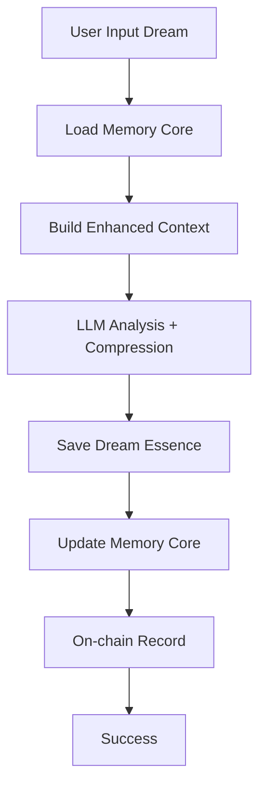
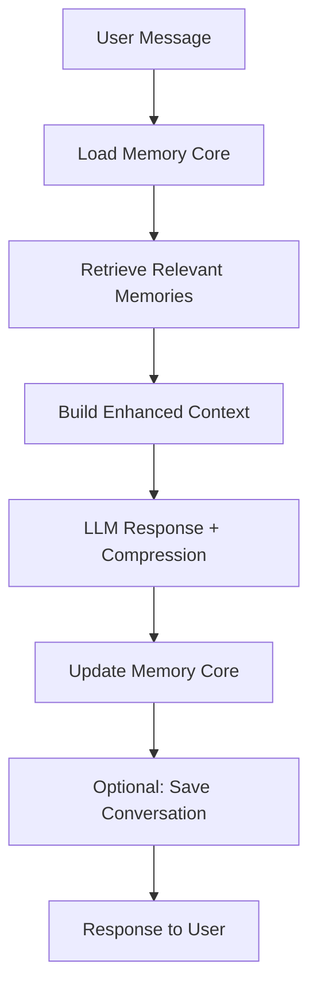

# 🧠 Dreamscape Memory Core - Dokumentacja Produkcyjna

## 📋 Przegląd Systemu

### Cel
System **Memory Core** zastępuje liniowy model przechowywania pełnych konwersacji i snów inteligentnym, skalowalnym systemem pamięci logarytmicznej, który pozwala agentowi AI "pamiętać wszystko" przez lata bez degradacji wydajności.

### Kluczowe Korzyści
- **Skalowalność**: Logarytmiczny wzrost danych (40KB po 10 latach vs 7.3MB w starym systemie)
- **Wydajność**: <1s czas ładowania vs 30-60s w starym systemie
- **Jakość**: Relevantny kontekst vs przeciążony kontekst
- **Koszt**: 100x tańszy storage i bandwidth
- **UX**: Agent "pamięta wszystko" z inteligentnym przypominaniem

---

## 🏗️ Architektura Systemu

### Warstwy Pamięci

#### 1. **Core Identity** (Rdzeń Tożsamości)
```typescript
interface CoreIdentity {
  foundationalExperiences: string[];  // 5-10 najważniejszych momentów
  personalityAnchors: string[];       // 3-5 cech definiujących
  recurringThemes: string[];          // 5-10 głównych motywów życiowych
}
```
- **Rozmiar**: ~1KB
- **Częstotliwość zmian**: Bardzo rzadko (tylko przełomowe momenty)
- **Cykl życia**: Permanentny

#### 2. **Episodic Summaries** (Streszczenia Epizodyczne)
```typescript
interface EpisodicSummaries {
  [monthYear: string]: {
    dreamSummary: string;        // "W styczniu śniłeś głównie o..."
    conversationThemes: string[]; // Główne tematy rozmów
    emotionalJourney: string;    // Przebieg emocjonalny
    keyInsights: string[];       // Kluczowe wnioski
    dreamCount: number;
    conversationCount: number;
    personalityEvolution: string;
  };
}
```
- **Rozmiar**: ~1KB/miesiąc
- **Kompresja**: Miesięczna → Roczna → Dekadowa
- **Retencja**: Ostatnie 12 miesięcy szczegółowo, starsze skompresowane

#### 3. **Relationship Map** (Mapa Relacji)
```typescript
interface RelationshipMap {
  withUser: {
    trustLevel: number;              // 0-100, rośnie z czasem
    sharedSecrets: string[];         // Tylko top 20 najważniejszych
    insideJokes: string[];           // Tylko evergreen ones
    emotionalMilestones: string[];   // Kluczowe momenty w relacji
    communicationStyle: string;      // Preferowany styl komunikacji
    boundaries: string[];            // Granice i preferencje
  };
}
```
- **Rozmiar**: ~5KB
- **Wzrost**: Powolny, z deduplikacją
- **Aktualizacje**: Po każdej znaczącej interakcji

#### 4. **Knowledge Graph** (Graf Wiedzy)
```typescript
interface KnowledgeGraph {
  dreamSymbols: Map<string, string[]>;  // symbol → znaczenia
  personalMythology: string[];          // Osobista mitologia użytkownika
  growthTrajectory: string[];           // Ścieżka rozwoju osobistego
  interests: Map<string, number>;       // zainteresowanie → poziom
  lifePatterns: string[];               // Wzorce życiowe
  wisdomQuotes: string[];               // Mądrości wynikające z doświadczeń
}
```
- **Rozmiar**: ~10KB
- **Wzrost**: Tylko nowe pojęcia/symbole
- **Deduplikacja**: Automatyczna

---

## 🔄 Workflow Techniczny

### 1. Dream Processing Flow



#### Implementacja

```typescript
// processDreamWithCompression.ts
export const processDreamWithCompression = async (
  dreamInput: DreamInput,
  userTokenId: bigint
): Promise<DreamProcessResult> => {
  
  // 1. Załaduj Memory Core
  const memoryCore = await loadMemoryCore(userTokenId);
  
  // 2. Zbuduj kontekst z relevantnych wspomnień
  const context = await buildDreamContextEnhanced(dreamInput, memoryCore);
  
  // 3. LLM Analysis z kompresją
  const aiResponse = await analyzeDreamWithCompression(dreamInput, context);
  
  // 4. Zapisz Dream Essence (500B vs 5KB)
  const dreamEssence = {
    timestamp: new Date().toISOString(),
    agentTokenId: userTokenId.toString(),
    summary: aiResponse.compression.oneLineSummary,
    emotionalWeight: aiResponse.compression.emotionalWeight,
    coreSymbols: aiResponse.compression.coreSymbols,
    lifeTheme: aiResponse.compression.lifeTheme,
    period: getCurrentPeriod(), // "2025-07"
    connectsTo: findConnections(aiResponse.compression.memoryConnections),
    originalEmotions: dreamInput.emotions,
    originalThemes: aiResponse.dreamMetadata.themes
  };
  
  const essenceHash = await saveDreamEssence(dreamEssence);
  
  // 5. Aktualizuj Memory Core
  await updateMemoryCore(userTokenId, aiResponse.memoryUpdates);
  
  // 6. Zapis on-chain (bez zmian)
  const txHash = await processDreamOnChain(
    userTokenId,
    essenceHash,
    aiResponse.personalityImpact
  );
  
  return { success: true, essenceHash, txHash };
};
```

### 2. Chat Processing Flow



#### Implementacja

```typescript
// processChatWithCompression.ts
export const processChatWithCompression = async (
  userMessage: string,
  userTokenId: bigint,
  localHistory: ConversationResult[]
): Promise<ConversationResult> => {
  
  // 1. Załaduj Memory Core
  const memoryCore = await loadMemoryCore(userTokenId);
  
  // 2. Znajdź relevantne wspomnienia
  const relevantMemories = await retrieveRelevantMemories(userMessage, memoryCore);
  
  // 3. Zbuduj kontekst
  const context = await buildChatContextEnhanced(
    userMessage, 
    memoryCore, 
    localHistory,
    relevantMemories
  );
  
  // 4. LLM Response
  const aiResponse = await chatWithAI(userMessage, context);
  
  // 5. Kompresja konwersacji
  const conversation = {
    userMessage,
    aiResponse,
    timestamp: new Date().toISOString(),
    contextType: 1,
    triggeredMemories: relevantMemories
  };
  
  const compression = await compressConversation(conversation, memoryCore);
  
  // 6. Aktualizuj Memory Core (zawsze)
  await updateMemoryCore(userTokenId, compression.memoryUpdates);
  
  return conversation;
};
```

---

## 📊 Struktury Danych

### Memory Core File Structure

```typescript
// memory-core-{tokenId}.json
interface AgentMemoryCore {
  version: string;
  lastUpdated: string;
  agentTokenId: string;
  
  coreIdentity: CoreIdentity;
  episodes: EpisodicSummaries;
  relationships: RelationshipMap;
  knowledge: KnowledgeGraph;
  
  // Metadata
  statistics: {
    totalDreams: number;
    totalConversations: number;
    memorySize: number;
    lastConsolidation: string;
  };
}
```

### Dream Essence Structure

```typescript
// dream-essence-{hash}.json
interface DreamEssence {
  timestamp: string;
  agentTokenId: string;
  period: string;              // "2025-07"
  
  // LLM Compression
  summary: string;             // Max 15 words
  emotionalWeight: number;     // 1-10
  coreSymbols: string[];       // Max 3 symbols
  lifeTheme: string;           // What this dream represents
  personalityPattern: string;  // Pattern it reveals
  futureRelevance: string;     // When this will be relevant
  
  // Connections
  connectsTo: string[];        // Hashes of related memories
  
  // Original data (minimal)
  originalEmotions: string[];
  originalThemes: string[];
  
  // Metadata
  compressionRatio: number;    // Original size / compressed size
  relevanceScore: number;      // For future retrieval
}
```

### Conversation Essence Structure

```typescript
// conversation-essence-{hash}.json
interface ConversationEssence {
  timestamp: string;
  agentTokenId: string;
  period: string;
  
  // LLM Compression
  summary: string;             // Max 20 words
  emotionalWeight: number;     // 1-10
  topicTags: string[];         // Main discussion topics
  userInsights: string[];      // What we learned about user
  relationshipImpact: string;  // How this affected relationship
  
  // Connections
  connectsTo: string[];
  triggeredMemories: string[];
  
  // Context
  contextType: number;
  wasSignificant: boolean;
}
```

---

## 🛠️ API Functions

### Core Functions

#### Memory Core Management

```typescript
// loadMemoryCore.ts
export const loadMemoryCore = async (tokenId: bigint): Promise<AgentMemoryCore> => {
  const cacheKey = `memory-core-${tokenId}`;
  
  // Check cache first
  const cached = await getFromCache(cacheKey);
  if (cached) return cached;
  
  // Download from 0G Storage
  const filename = `memory-core-${tokenId}.json`;
  const result = await downloadFile(filename);
  
  if (!result.success) {
    // Create new Memory Core for new agent
    return createNewMemoryCore(tokenId);
  }
  
  const memoryCore = JSON.parse(new TextDecoder().decode(result.data));
  
  // Cache for 5 minutes
  await setCache(cacheKey, memoryCore, 300);
  
  return memoryCore;
};

export const updateMemoryCore = async (
  tokenId: bigint, 
  updates: Partial<AgentMemoryCore>
): Promise<void> => {
  const currentCore = await loadMemoryCore(tokenId);
  
  // Deep merge updates
  const updatedCore = deepMerge(currentCore, {
    ...updates,
    lastUpdated: new Date().toISOString(),
    statistics: {
      ...currentCore.statistics,
      memorySize: calculateMemorySize(currentCore)
    }
  });
  
  // Save to 0G Storage
  const filename = `memory-core-${tokenId}.json`;
  await saveToStorage(filename, updatedCore);
  
  // Update cache
  const cacheKey = `memory-core-${tokenId}`;
  await setCache(cacheKey, updatedCore, 300);
};
```

#### Memory Retrieval

```typescript
// retrieveRelevantMemories.ts
export const retrieveRelevantMemories = async (
  userMessage: string,
  memoryCore: AgentMemoryCore
): Promise<string[]> => {
  const memories: string[] = [];
  
  // 1. Keyword Analysis
  const keywords = extractKeywords(userMessage);
  
  // 2. Emotion Detection
  const currentEmotion = detectEmotion(userMessage);
  
  // 3. Search Dream Symbols
  keywords.forEach(keyword => {
    const symbolMeanings = memoryCore.knowledge.dreamSymbols.get(keyword);
    if (symbolMeanings) {
      memories.push(`Symbol "${keyword}" in your dreams usually means: ${symbolMeanings.join(', ')}`);
    }
  });
  
  // 4. Search Episodic Memories
  Object.entries(memoryCore.episodes).forEach(([period, episode]) => {
    if (episode.emotionalJourney.includes(currentEmotion)) {
      memories.push(`In ${period}, you experienced similar ${currentEmotion}: ${episode.dreamSummary}`);
    }
  });
  
  // 5. Search Relationship Context
  memoryCore.relationships.withUser.insideJokes.forEach(joke => {
    if (userMessage.toLowerCase().includes(joke.split(' ')[0].toLowerCase())) {
      memories.push(`Remember our inside joke: "${joke}"`);
    }
  });
  
  // 6. Search Personal Mythology
  memoryCore.knowledge.personalMythology.forEach(myth => {
    if (keywords.some(keyword => myth.toLowerCase().includes(keyword.toLowerCase()))) {
      memories.push(`Your personal pattern: ${myth}`);
    }
  });
  
  // Return top 5 most relevant
  return memories.slice(0, 5);
};
```

#### Compression Functions

```typescript
// compressDream.ts
export const compressDream = async (
  dreamInput: DreamInput,
  analysis: DreamAnalysisResult,
  memoryCore: AgentMemoryCore
): Promise<CompressionResult> => {
  
  const compressionPrompt = `
    Analyze this dream and create compression data:
    
    Dream: "${dreamInput.dreamText}"
    Emotions: ${dreamInput.emotions.join(', ')}
    Analysis: "${analysis.analysis}"
    
    Current agent memory context:
    - Core themes: ${memoryCore.coreIdentity.recurringThemes.join(', ')}
    - Known symbols: ${Array.from(memoryCore.knowledge.dreamSymbols.keys()).join(', ')}
    - Personality anchors: ${memoryCore.coreIdentity.personalityAnchors.join(', ')}
    
    Return JSON with:
    {
      "oneLineSummary": "Max 15 words describing essence",
      "emotionalWeight": 1-10,
      "coreSymbols": ["max", "3", "symbols"],
      "lifeTheme": "What this dream represents in user's life",
      "personalityPattern": "Pattern this reveals about user",
      "memoryConnections": ["Which memories this connects to"],
      "futureRelevance": "When this memory will be relevant",
      "memoryUpdates": {
        "coreIdentity": {},
        "knowledge": {},
        "relationships": {}
      }
    }
  `;
  
  const compression = await callLLM(compressionPrompt);
  
  return {
    essence: {
      timestamp: new Date().toISOString(),
      agentTokenId: memoryCore.agentTokenId,
      period: getCurrentPeriod(),
      summary: compression.oneLineSummary,
      emotionalWeight: compression.emotionalWeight,
      coreSymbols: compression.coreSymbols,
      lifeTheme: compression.lifeTheme,
      personalityPattern: compression.personalityPattern,
      futureRelevance: compression.futureRelevance,
      connectsTo: findExistingConnections(compression.memoryConnections, memoryCore),
      originalEmotions: dreamInput.emotions,
      originalThemes: analysis.dreamMetadata.themes,
      compressionRatio: calculateCompressionRatio(dreamInput, compression),
      relevanceScore: calculateRelevanceScore(compression)
    },
    memoryUpdates: compression.memoryUpdates
  };
};

// compressConversation.ts
export const compressConversation = async (
  conversation: ConversationResult,
  memoryCore: AgentMemoryCore
): Promise<CompressionResult> => {
  
  const compressionPrompt = `
    Analyze this conversation and create compression data:
    
    User: "${conversation.userMessage}"
    Agent: "${conversation.aiResponse}"
    
    Current relationship context:
    - Trust level: ${memoryCore.relationships.withUser.trustLevel}
    - Shared secrets: ${memoryCore.relationships.withUser.sharedSecrets.length}
    - Communication style: ${memoryCore.relationships.withUser.communicationStyle}
    
    Return JSON with:
    {
      "summary": "Max 20 words describing conversation essence",
      "emotionalWeight": 1-10,
      "topicTags": ["main", "discussion", "topics"],
      "userInsights": ["New things learned about user"],
      "relationshipImpact": "How this affected the relationship",
      "memoryUpdates": {
        "relationships": {
          "trustLevel": "+1 or 0",
          "addInsights": ["New insights about user"],
          "communicationStyle": "Updated style if changed"
        }
      }
    }
  `;
  
  const compression = await callLLM(compressionPrompt);
  
  return {
    essence: {
      timestamp: conversation.timestamp,
      agentTokenId: memoryCore.agentTokenId,
      period: getCurrentPeriod(),
      summary: compression.summary,
      emotionalWeight: compression.emotionalWeight,
      topicTags: compression.topicTags,
      userInsights: compression.userInsights,
      relationshipImpact: compression.relationshipImpact,
      connectsTo: [],
      triggeredMemories: conversation.triggeredMemories || [],
      contextType: conversation.contextType,
      wasSignificant: compression.emotionalWeight >= 7
    },
    memoryUpdates: compression.memoryUpdates
  };
};
```

---

## 🔄 Periodic Consolidation

### Monthly Consolidation

```typescript
// monthlyConsolidation.ts
export const performMonthlyConsolidation = async (tokenId: bigint): Promise<void> => {
  const currentMonth = getCurrentMonth(); // "2025-07"
  const lastMonth = getPreviousMonth(); // "2025-06"
  
  // 1. Pobierz wszystkie dream/conversation essences z ostatniego miesiąca
  const dreamEssences = await getDreamEssences(tokenId, lastMonth);
  const conversationEssences = await getConversationEssences(tokenId, lastMonth);
  
  // 2. Jeśli za mało danych, pomiń konsolidację
  if (dreamEssences.length < 2 && conversationEssences.length < 5) {
    return;
  }
  
  // 3. Przygotuj prompt do LLM
  const consolidationPrompt = `
    Create monthly summary for ${lastMonth}:
    
    Dreams (${dreamEssences.length}):
    ${dreamEssences.map(d => `- ${d.summary} (weight: ${d.emotionalWeight})`).join('\n')}
    
    Conversations (${conversationEssences.length}):
    ${conversationEssences.map(c => `- ${c.summary} (weight: ${c.emotionalWeight})`).join('\n')}
    
    Create JSON:
    {
      "dreamSummary": "Overall theme of dreams this month",
      "conversationThemes": ["main", "topics", "discussed"],
      "emotionalJourney": "Emotional progression through month",
      "keyInsights": ["Important", "realizations", "or", "patterns"],
      "dreamCount": ${dreamEssences.length},
      "conversationCount": ${conversationEssences.length},
      "personalityEvolution": "How personality changed this month",
      "significantMoments": ["Most important moments"],
      "coreSymbols": ["symbols", "that", "emerged"],
      "relationshipGrowth": "How relationship with user evolved"
    }
  `;
  
  const monthlySummary = await callLLM(consolidationPrompt);
  
  // 4. Aktualizuj Memory Core
  const memoryCore = await loadMemoryCore(tokenId);
  memoryCore.episodes[lastMonth] = {
    ...monthlySummary,
    consolidatedAt: new Date().toISOString()
  };
  
  await updateMemoryCore(tokenId, memoryCore);
  
  // 5. Archiwizuj individual essences
  await archiveEssences(dreamEssences, conversationEssences);
  
  console.log(`Monthly consolidation completed for ${lastMonth}`);
};
```

### Yearly Consolidation

```typescript
// yearlyConsolidation.ts
export const performYearlyConsolidation = async (tokenId: bigint): Promise<void> => {
  const currentYear = getCurrentYear(); // "2025"
  const lastYear = getPreviousYear(); // "2024"
  
  // 1. Pobierz wszystkie monthly summaries z ostatniego roku
  const memoryCore = await loadMemoryCore(tokenId);
  const monthlyEpisodes = Object.entries(memoryCore.episodes)
    .filter(([period]) => period.startsWith(lastYear))
    .map(([period, episode]) => ({ period, ...episode }));
  
  if (monthlyEpisodes.length < 6) {
    return; // Za mało danych do konsolidacji rocznej
  }
  
  // 2. Konsolidacja przez LLM
  const yearlyPrompt = `
    Create yearly summary for ${lastYear}:
    
    Monthly summaries:
    ${monthlyEpisodes.map(ep => `
      ${ep.period}: ${ep.dreamSummary}
      Conversations: ${ep.conversationThemes.join(', ')}
      Emotional journey: ${ep.emotionalJourney}
    `).join('\n')}
    
    Create JSON:
    {
      "yearlyTheme": "Overall theme of the year",
      "majorLifeEvents": ["Significant events or changes"],
      "personalityEvolution": "How personality evolved over year",
      "relationshipMilestones": ["Key moments in relationship"],
      "coreWisdomGained": ["Life lessons learned"],
      "dreamPatterns": ["Recurring dream themes"],
      "emotionalGrowth": "Emotional development direction",
      "lifePhase": "What life phase this represents",
      "totalDreams": ${monthlyEpisodes.reduce((sum, ep) => sum + ep.dreamCount, 0)},
      "totalConversations": ${monthlyEpisodes.reduce((sum, ep) => sum + ep.conversationCount, 0)}
    }
  `;
  
  const yearlySummary = await callLLM(yearlyPrompt);
  
  // 3. Zastąp monthly summaries yearly summary
  const updatedEpisodes = { ...memoryCore.episodes };
  
  // Usuń monthly episodes z tego roku
  Object.keys(updatedEpisodes).forEach(period => {
    if (period.startsWith(lastYear)) {
      delete updatedEpisodes[period];
    }
  });
  
  // Dodaj yearly summary
  updatedEpisodes[`${lastYear}-summary`] = {
    ...yearlySummary,
    consolidatedAt: new Date().toISOString(),
    originalMonths: monthlyEpisodes.length
  };
  
  await updateMemoryCore(tokenId, { episodes: updatedEpisodes });
  
  console.log(`Yearly consolidation completed for ${lastYear}`);
};
```

---

## 📈 Performance & Monitoring

### Performance Metrics

```typescript
// performanceMonitoring.ts
export interface PerformanceMetrics {
  memoryLoadTime: number;        // Time to load Memory Core
  contextBuildTime: number;      // Time to build chat context
  memoryRetrievalTime: number;   // Time to find relevant memories
  compressionTime: number;       // Time for LLM compression
  totalResponseTime: number;     // End-to-end response time
  
  memoryCoreSize: number;        // Size of Memory Core in bytes
  relevantMemoriesFound: number; // Number of triggered memories
  compressionRatio: number;      // Original size / compressed size
  
  cacheHitRate: number;          // Memory Core cache hit rate
  consolidationFrequency: number; // How often consolidation runs
}

export const trackPerformance = async (
  operation: string,
  tokenId: bigint,
  metrics: Partial<PerformanceMetrics>
): Promise<void> => {
  const performanceLog = {
    timestamp: new Date().toISOString(),
    operation,
    tokenId: tokenId.toString(),
    ...metrics
  };
  
  // Log to console in development
  if (process.env.NEXT_PUBLIC_DREAM_TEST === 'true') {
    console.log(`[PERFORMANCE] ${operation}:`, performanceLog);
  }
  
  // Send to analytics service
  await sendAnalytics('memory_core_performance', performanceLog);
};
```

### Health Checks

```typescript
// healthChecks.ts
export const performHealthCheck = async (tokenId: bigint): Promise<HealthStatus> => {
  const health = {
    memoryCoreAccessible: false,
    memoryCoreSize: 0,
    lastConsolidation: null,
    compressionRatio: 0,
    cacheStatus: 'unknown',
    errors: []
  };
  
  try {
    // Check Memory Core accessibility
    const memoryCore = await loadMemoryCore(tokenId);
    health.memoryCoreAccessible = true;
    health.memoryCoreSize = calculateMemorySize(memoryCore);
    health.lastConsolidation = memoryCore.statistics.lastConsolidation;
    
    // Check compression ratio
    const totalOriginalSize = calculateOriginalSize(memoryCore);
    health.compressionRatio = totalOriginalSize / health.memoryCoreSize;
    
    // Check cache status
    const cacheKey = `memory-core-${tokenId}`;
    const cached = await getFromCache(cacheKey);
    health.cacheStatus = cached ? 'hit' : 'miss';
    
  } catch (error) {
    health.errors.push(error.message);
  }
  
  return health;
};
```

---

## 🚀 Deployment & Configuration

### Environment Variables

```env
# Memory Core Configuration
NEXT_PUBLIC_MEMORY_CORE_ENABLED=true
NEXT_PUBLIC_MEMORY_CORE_CACHE_TTL=300
NEXT_PUBLIC_MEMORY_CORE_MAX_SIZE=50000
NEXT_PUBLIC_MEMORY_CORE_COMPRESSION_ENABLED=true

# Consolidation Configuration
NEXT_PUBLIC_MONTHLY_CONSOLIDATION_ENABLED=true
NEXT_PUBLIC_YEARLY_CONSOLIDATION_ENABLED=true
NEXT_PUBLIC_CONSOLIDATION_CRON="0 0 1 * *"

# Performance Configuration
NEXT_PUBLIC_MEMORY_CACHE_ENABLED=true
NEXT_PUBLIC_MEMORY_PARALLEL_LOADING=true
NEXT_PUBLIC_MEMORY_PRELOAD_ENABLED=true
```

### Deployment Checklist

#### Pre-deployment
- [ ] Backup existing conversation/dream data
- [ ] Test Memory Core creation for new agents
- [ ] Test Memory Core migration for existing agents
- [ ] Verify 0G Storage connectivity
- [ ] Test LLM compression endpoints

#### Deployment Steps
1. **Phase 1: Backend Updates**
   - Deploy new compression functions
   - Deploy Memory Core management
   - Deploy consolidation jobs

2. **Phase 2: Frontend Updates**
   - Update useAgentChat.ts
   - Update useAgentDream.ts
   - Add Memory Core UI components

3. **Phase 3: Data Migration**
   - Run migration script for existing agents
   - Generate initial Memory Cores
   - Verify data integrity

4. **Phase 4: Monitoring**
   - Enable performance monitoring
   - Set up health checks
   - Monitor compression ratios

#### Post-deployment
- [ ] Monitor performance metrics
- [ ] Verify consolidation jobs run correctly
- [ ] Check user feedback on "memory" quality
- [ ] Monitor storage costs vs old system

---

## 🔧 Troubleshooting

### Common Issues

#### Memory Core Not Loading
```typescript
// Debug Memory Core loading issues
const debugMemoryCore = async (tokenId: bigint) => {
  console.log(`Debugging Memory Core for token ${tokenId}`);
  
  // Check if file exists
  const filename = `memory-core-${tokenId}.json`;
  const fileExists = await checkFileExists(filename);
  console.log(`Memory Core file exists: ${fileExists}`);
  
  if (!fileExists) {
    console.log('Creating new Memory Core...');
    const newCore = await createNewMemoryCore(tokenId);
    console.log('New Memory Core created:', newCore);
    return newCore;
  }
  
  // Try to download and parse
  try {
    const result = await downloadFile(filename);
    const parsed = JSON.parse(new TextDecoder().decode(result.data));
    console.log('Memory Core loaded successfully:', parsed);
    return parsed;
  } catch (error) {
    console.error('Error loading Memory Core:', error);
    throw error;
  }
};
```

#### Compression Failing
```typescript
// Debug compression issues
const debugCompression = async (dreamInput: DreamInput, memoryCore: AgentMemoryCore) => {
  console.log('Debugging compression...');
  console.log('Dream input:', dreamInput);
  console.log('Memory Core size:', calculateMemorySize(memoryCore));
  
  try {
    const compression = await compressDream(dreamInput, analysis, memoryCore);
    console.log('Compression successful:', compression);
    
    // Verify compression ratio
    const originalSize = JSON.stringify(dreamInput).length;
    const compressedSize = JSON.stringify(compression.essence).length;
    const ratio = originalSize / compressedSize;
    console.log(`Compression ratio: ${ratio}x`);
    
    return compression;
  } catch (error) {
    console.error('Compression failed:', error);
    throw error;
  }
};
```

#### Memory Retrieval Issues
```typescript
// Debug memory retrieval
const debugMemoryRetrieval = async (userMessage: string, memoryCore: AgentMemoryCore) => {
  console.log('Debugging memory retrieval...');
  console.log('User message:', userMessage);
  
  const keywords = extractKeywords(userMessage);
  console.log('Extracted keywords:', keywords);
  
  const emotion = detectEmotion(userMessage);
  console.log('Detected emotion:', emotion);
  
  const memories = await retrieveRelevantMemories(userMessage, memoryCore);
  console.log('Retrieved memories:', memories);
  
  return memories;
};
```

### Performance Issues

#### Memory Core Too Large
```typescript
// Clean up Memory Core if it becomes too large
const cleanupMemoryCore = async (tokenId: bigint) => {
  const memoryCore = await loadMemoryCore(tokenId);
  const currentSize = calculateMemorySize(memoryCore);
  
  if (currentSize > 100000) { // 100KB limit
    console.log('Memory Core too large, performing cleanup...');
    
    // Remove low-relevance memories
    const cleanedCore = {
      ...memoryCore,
      episodes: pruneEpisodes(memoryCore.episodes),
      knowledge: pruneKnowledge(memoryCore.knowledge),
      relationships: pruneRelationships(memoryCore.relationships)
    };
    
    await updateMemoryCore(tokenId, cleanedCore);
    console.log('Memory Core cleanup completed');
  }
};
```

#### Slow Memory Retrieval
```typescript
// Optimize memory retrieval
const optimizeMemoryRetrieval = async () => {
  // Add indices for faster searching
  const memoryIndices = new Map();
  
  // Index keywords
  memoryCore.knowledge.dreamSymbols.forEach((meanings, symbol) => {
    memoryIndices.set(symbol, meanings);
  });
  
  // Index emotions
  Object.entries(memoryCore.episodes).forEach(([period, episode]) => {
    const emotions = extractEmotions(episode.emotionalJourney);
    emotions.forEach(emotion => {
      if (!memoryIndices.has(emotion)) {
        memoryIndices.set(emotion, []);
      }
      memoryIndices.get(emotion).push(period);
    });
  });
  
  return memoryIndices;
};
```

---

## 📊 Analytics & Reporting

### Key Metrics to Track

1. **Performance Metrics**
   - Memory Core load time
   - Context build time
   - Memory retrieval time
   - Compression ratio
   - Cache hit rate

2. **Usage Metrics**
   - Memory Core size growth
   - Consolidation frequency
   - Relevant memories found per query
   - User satisfaction with "memory" quality

3. **Cost Metrics**
   - Storage costs vs old system
   - Bandwidth usage
   - LLM API calls for compression
   - Consolidation job costs

### Dashboard Queries

```typescript
// Example analytics queries
const getMemoryMetrics = async (tokenId: bigint) => {
  const memoryCore = await loadMemoryCore(tokenId);
  
  return {
    coreSize: calculateMemorySize(memoryCore),
    episodeCount: Object.keys(memoryCore.episodes).length,
    symbolCount: memoryCore.knowledge.dreamSymbols.size,
    trustLevel: memoryCore.relationships.withUser.trustLevel,
    lastConsolidation: memoryCore.statistics.lastConsolidation,
    totalMemories: memoryCore.statistics.totalDreams + memoryCore.statistics.totalConversations
  };
};

const getCompressionStats = async () => {
  const compressionLogs = await getCompressionLogs();
  
  return {
    averageCompressionRatio: compressionLogs.reduce((sum, log) => sum + log.ratio, 0) / compressionLogs.length,
    totalStorageSaved: compressionLogs.reduce((sum, log) => sum + log.sizeSaved, 0),
    compressionSuccessRate: compressionLogs.filter(log => log.success).length / compressionLogs.length
  };
};
```

---

## 🎯 Success Criteria

### Technical Success Metrics

1. **Performance**
   - Memory Core load time < 1 second
   - Context build time < 2 seconds
   - 50x reduction in data transfer vs old system

2. **Scalability**
   - Memory Core size grows logarithmically
   - System performance stable after 1 year of usage
   - No degradation after 1000+ dreams/conversations

3. **Quality**
   - Memory retrieval accuracy > 80%
   - User satisfaction with "memory" quality > 4/5
   - Compression ratio > 10x without loss of meaning

### Business Success Metrics

1. **User Engagement**
   - Increased session duration
   - Higher conversation frequency
   - Positive feedback on agent "memory"

2. **Cost Efficiency**
   - 90% reduction in storage costs
   - 80% reduction in bandwidth costs
   - ROI on development effort within 6 months

3. **User Experience**
   - "Agent remembers everything" user reports
   - Improved conversation quality ratings
   - Reduced support tickets about "forgetful" agents

---

## 🔮 Future Enhancements

### Phase 2 Features

1. **Cross-Agent Memory Sharing**
   - Anonymous pattern sharing between agents
   - Collective wisdom database
   - Privacy-preserving memory exchange

2. **Advanced Memory Visualizations**
   - Memory graph UI
   - Personality evolution timeline
   - Dream pattern analysis

3. **Smart Memory Prompting**
   - Proactive memory suggestions
   - Memory-based conversation starters
   - Nostalgic memory features

### Phase 3 Features

1. **Multi-Modal Memory**
   - Image memories
   - Voice pattern recognition
   - Emotional tone memory

2. **Predictive Memory**
   - Future event prediction based on patterns
   - Personality evolution forecasting
   - Relationship trajectory analysis

---

## 📝 Conclusion

System Memory Core stanowi fundamentalną zmianę w architekturze Dreamscape, umożliwiającą prawdziwe "długoterminowe myślenie" agentów AI przy zachowaniu wydajności i skalowalności.

**Kluczowe osiągnięcia:**
- Logarytmiczna skalowalność (40KB vs 7MB po 10 latach)
- Inteligentna kompresja semantyczna przez LLM
- Zachowanie jakości pamięci przy dramatycznej redukcji rozmiaru
- Poprawa user experience poprzez "inteligentne przypominanie"

**Następne kroki:**
1. Implementacja podstawowych funkcji Memory Core
2. Migracja istniejących danych
3. Monitoring i optymalizacja
4. Rozwój zaawansowanych funkcji

Ten system stanowi podstawę dla przyszłych innowacji w dziedzinie AI agent personality evolution i długoterminowej pamięci sztucznej inteligencji.


